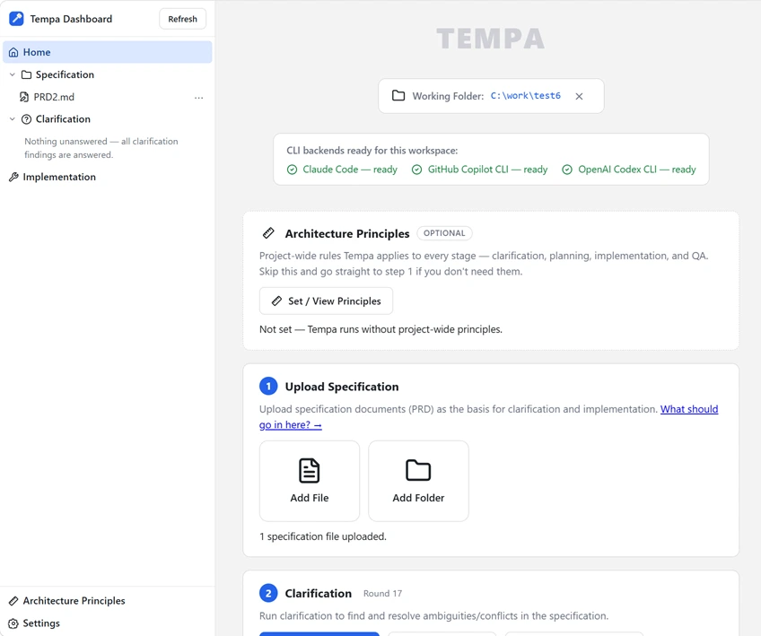
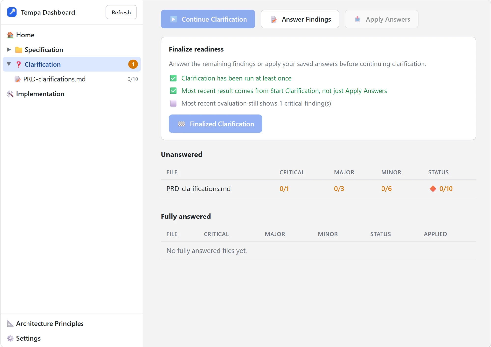

# Tempa — Claude Automation Harness

[](https://github.com/daus95/tempa/actions/workflows/tests.yml)
[](https://github.com/daus95/tempa/releases)
[](LICENSE)

> Turn a spec into a working app — clarified, planned, implemented, and QA'd
> automatically, while you do something else.

Turning a spec into working software usually means endless manual back-and-forth:
clarifying vague requirements, breaking the work into a plan, implementing it feature by
feature, and catching bugs before they pile up — one `claude` session at a time, babysat
from start to finish.

**Tempa automates that entire loop.** It drives the **Claude CLI** repeatedly and
unattended: clarifying your PRD until nothing critical is left ambiguous, drafting a plan
(epic → feature → task), implementing it, and running QA — start it once, walk away, and
come back to real progress instead of a blank terminal. It runs on your existing Claude
subscription via the `claude` CLI login you already have — no separate per-token API
billing to provision or watch.

Official repo: [github.com/daus95/tempa](https://github.com/daus95/tempa)

> Once set up, the recommended way to drive Tempa is the web **dashboard**
> (`tempa dashboard`) — see [Dashboard (Recommended)](#dashboard-recommended) below. Every
> dashboard action also has an equivalent CLI command (`tempa <command>`), for power users
> or scripting.

---

## Contents

1. [Quick Start](#quick-start)
2. [Setup (One-Time Only)](#setup-one-time-only)
3. [Dashboard (Recommended)](#dashboard-recommended)
4. [Command Line Interface (CLI)](#command-line-interface-cli)
5. [Further Reference](#further-reference)

---

## Quick Start

> Already have Python 3 and an authenticated `claude` CLI installed? This is the fast path.
> Missing one of those, or want the full explanation of each step? See
> [Setup (One-Time Only)](#setup-one-time-only) below instead.

1. **Download & extract** — [⬇ Download tempa.zip](https://github.com/daus95/tempa/archive/refs/heads/main.zip)
   to a folder **outside** your project repo. Details:
   [Setup Step 2 — Download & Install](#step-2--download--install).

2. **Open the dashboard** — double-click **`Open Dashboard.cmd`** (Windows) /
   **`Open Dashboard.command`** (macOS) / **`Open Dashboard.sh`** (Linux) in that folder.

3. **Point Tempa at your project:** on the Home page, click **Select Working Folder** and
   pick your project folder — no terminal needed. (Linux: needs `zenity` or `kdialog`
   installed for the picker dialog — both ship by default on most desktop distros; if
   neither is installed, use the CLI fallback instead: from inside the extracted folder,
   run
   ```bash
   ./tempa init C:\repo\<your-repo>
   ```
   then reload the dashboard.)

4. **Follow the dashboard's checklist** — Upload Specification → Clarification → Start
   Implementation. See [Dashboard (Recommended)](#dashboard-recommended).

Prefer the terminal for everything? See
[Command Line Interface (CLI)](#command-line-interface-cli) for the full command-driven
workflow (`tempa init`, `tempa clarify`, `tempa implement`).

---

## Setup (One-Time Only)

> Done once per machine. Once this is done, the recommended way to do the recurring work
> is the [Dashboard](#dashboard-recommended) section below — power users can use the CLI
> [Command Line Interface (CLI)](#command-line-interface-cli) section instead (its first step points
> Tempa at your project).

### Step 1 — Prerequisites

1. **Python 3** installed (`py` / `python` on PATH).
2. **Claude CLI** installed and on PATH (`claude` or `claude.cmd`).
   The harness calls it with `--dangerously-skip-permissions` (fully automated mode, no
   human confirmation).
3. Already logged in / authenticated with Claude.

---

### Step 2 — Download & Install

Download the Tempa code as a ZIP file (no clone needed), then extract it to the folder you
want:

[⬇ Download tempa.zip](https://github.com/daus95/tempa/archive/refs/heads/main.zip)

Put the extracted contents in a folder **separate from, and outside**, the repo you're going
to work on — don't put it inside your repo folder, so it doesn't get committed to your git
repo. Keep the whole folder together: the launcher puts `src/` on the import path and the
modules import each other by name, so nothing works if they're separated. For example, if
your repo is at `C:\repo\<your-repo>`, place Tempa as a sibling folder, e.g. `C:\tools\tempa`
or `C:\repo\tempa` (not `C:\repo\<your-repo>\tempa`). Full layout of what's inside that
folder: [docs/folders-and-paths.md](docs/folders-and-paths.md#the-tempa-install-folder).

Add that Tempa folder to your `PATH` so the `tempa` command works from anywhere:

- **Windows:** add the folder (e.g. `C:\tools\tempa`) to your user `PATH`, then open a new
  terminal. `tempa <command>` runs `tempa.cmd`, which calls `tempa <command>` internally.
- **macOS/Linux:** add the folder to your `PATH` (e.g. in `~/.zshrc` / `~/.bashrc`:
  `export PATH="$HOME/tools/tempa:$PATH"`), then open a new terminal. `tempa <command>` runs
  the `tempa` script, which calls `python3 tempa.py <command>` internally — no `chmod` needed,
  the executable bit is already set in the repo.

Prefer not to touch `PATH`? Run it directly from inside the Tempa folder instead. Every
`tempa <command>` in the rest of this README means one of these three — pick the line for your
setup:

```bash
tempa <command>            # PATH set (any OS)
./tempa.cmd <command>      # Windows, without PATH
./tempa <command>          # macOS/Linux, without PATH
```

Quickly check everything is ready before moving to the next step — it verifies the Claude CLI can
Write/Read/Delete a file:

```bash
tempa test                 # PATH set (any OS)
./tempa.cmd test           # Windows, without PATH
./tempa test               # macOS/Linux, without PATH
```

### No terminal? Double-click to open the dashboard

If you found the Tempa folder in Windows Explorer / macOS Finder / a Linux file manager and
would rather not open a terminal at all, double-click the launcher for your OS instead of
running `tempa dashboard`:

| OS | File | Notes |
|---|---|---|
| Windows | `Open Dashboard.cmd` | Double-click. A console window opens with the dashboard's log — that's normal, not an error. |
| macOS | `Open Dashboard.command` | Double-click. First run: right-click → **Open** once (Gatekeeper blocks unsigned scripts on a plain double-click), then double-click normally afterwards. |
| Linux | `Open Dashboard.sh` | Most file managers require marking it executable first — right-click → **Properties → Permissions → Allow executing** (or run `chmod +x "Open Dashboard.sh"` once from a terminal) — then double-click, or **Run** if prompted. |

Each one does exactly what `tempa dashboard` does and opens your browser to it. **Keep the
window that opens alongside your browser open** — that's the server; closing it stops the
dashboard. If Python isn't installed, the window explains that and waits so you can read it.

---

## Dashboard (Recommended)

> Prefer the terminal, or need to script Tempa? Every action below has a matching CLI
> command — skip ahead to [Command Line Interface (CLI)](#command-line-interface-cli).

The dashboard walks you through the same specification → clarification → implementation
flow as the CLI, but with buttons, inline file editing, and live progress instead of
memorizing commands and flags. Start it with:

```bash
tempa dashboard            # PATH set (any OS)
./tempa.cmd dashboard      # Windows, without PATH
./tempa dashboard          # macOS/Linux, without PATH
```

This opens `http://127.0.0.1:<port>/` in your browser (`Ctrl+C` in the terminal stops the
server). If the project hasn't been set up yet, the **Home** page shows a
**Select Working Folder** button — click it to pick your project via a native dialog and
Tempa sets it up for you, no terminal involved. (Linux: needs `zenity` or `kdialog`
installed — see below. Without either, run `tempa init <path>` from the CLI once instead,
then reload the dashboard.)



The Home page is a 3-step checklist; each step unlocks once the one before it is satisfied.
Above it sits one optional card you can ignore entirely:

```
┌╌╌╌╌╌╌╌╌╌╌╌╌╌╌╌╌╌╌╌╌╌╌╌╌╌╌╌┐
╎  Architecture Principles  ╎  (optional — skip straight to step 1)
└╌╌╌╌╌╌╌╌╌╌╌╌╌┬╌╌╌╌╌╌╌╌╌╌╌╌╌┘
              │
              ▼
┌───────────────────────────┐
│  1. Upload Specification  │
└─────────────┬─────────────┘
              │
              ▼
┌───────────────────────────┐
│  2. Clarification         │  (Start Clarification → answer → Apply Answers → repeat)
└─────────────┬─────────────┘
              │
              ▼
┌───────────────────────────┐
│  3. Start Implementation  │
└───────────────────────────┘
```

| Dashboard step | Equivalent CLI step |
|---|---|
| **Select Working Folder** button (prerequisite, not shown above; Linux needs `zenity`/`kdialog` — see below) | [Step 1 — Initial Setup](#step-1--initial-setup) (`tempa init <path>`) |
| [Step 1 — Upload Specification](#step-1--upload-specification) | [Step 2 — Write the specification](#step-2--write-the-specification) |
| [Step 2 — Clarification](#step-2--clarification) | [Step 3 — Answer clarifications](#step-3--answer-clarifications-clarify) (`tempa clarify`) |
| [Step 3 — Start Implementation](#step-3--start-implementation) | [Step 4 — Run implementation](#step-4--run-implementation-implement) (`tempa implement`) |

### Architecture Principles (optional)

Tempa runs your project through several separate Claude sessions — clarification, planning,
implementation, QA, verification — and none of them remembers the previous one. **Architecture
Principles** is where you write the rules that should hold across all of them: which database you
use, whether an ORM is allowed, how API errors are shaped, what has to be true before code counts
as done. Tempa prepends them to *every* prompt it sends, so the same rules stay in force
everywhere instead of each session falling back on generic defaults.

Click **Set / View Principles** on the card (or the sidebar entry) to open a free-form Markdown
editor, plus a **Learn more** page with worked examples and the mistakes to avoid. Saving an empty
box removes the principles again.

This is entirely optional — leave it empty and Tempa behaves exactly as it did before, with
nothing injected. Full reference: [docs/architecture-principles.md](docs/architecture-principles.md).

### Step 1 — Upload Specification

Click **Add File** or **Add Folder** to upload your PRD/spec documents straight from the
browser (they land in the same `sources.prd` folder `tempa init` created). Uploaded files
appear under **Specification** in the left sidebar — click one to **View** it as rendered
markdown, or switch to **Edit** and **Save** to change it right there, no separate editor
needed. Right-click a file or folder in the sidebar for **Rename** / **Delete**. You can upload
more than one file — Tempa reads all of them together during clarification and planning.

Only upload the **new** specification you want implemented here — not old/already-implemented
ones. Specifications for the **existing** system belong separately in the `sources.docs`
folder (default `docs/`), not here: plan drafting uses `docs/` (and the code) as a reference
for "what already exists", so it doesn't duplicate work that's already done.

The new specification should ideally cover:

- **Purpose of the application** — what problem it solves, for whom.
- **Business process** — the workflow/steps the system needs to support.
- **Data model** — the main entities and their relationships.
- **UI concept** — a picture of the pages/interactions you want.
- **Tech stack** you want (language, framework, database, etc).

The more completely these five aspects are written up, the closer the resulting application
will match what you actually want. Full reference, with worked examples and common mistakes:
[docs/writing-a-spec.md](docs/writing-a-spec.md) (also linked as **What should go in here? →**
next to Add File/Add Folder on the dashboard's Upload Specification step).

Not sure how to start, or just want to try Tempa out first? The [examples/](examples/)
folder has ready-to-use sample PRDs (from a simple client-side app to a full web app with a
database) — upload them here via **Add File**/**Add Folder**, or copy them straight into
`.tempa/specs/prd` — see [examples/README.md](examples/README.md).

### Step 2 — Clarification

**Start Clarification** runs one evaluation pass and lists every finding (critical/major/
minor), grouped by file, under **Clarification** in the sidebar. Open a file to answer its
findings inline: for each finding, choose **Follow the recommendation** or **I'll write my
own answer** (a text box appears), then **Save**. Once a file is fully answered, click
**Apply Answers** to write those resolutions back into the PRD/spec — applying automatically
chains straight into a fresh evaluation pass afterward, so you don't have to trigger it
yourself. Once clarification has run at least once, the button relabels to **Continue
Clarification** (with a hint explaining what's still blocking it, if anything is) for the
rest of this loop. This loop (evaluate → answer → apply → re-evaluate) is the dashboard
version of Workflow Step 3 below.



**Answer manually during the early iterations** (usually the first 3–4 rounds): early on,
the system doesn't yet have enough project context to guess your intent accurately — its
recommended answers can still be off. Important decisions (application purpose, business
process, tech stack, etc.) need your direct input first, so the PRD starts off pointed in
the right direction.

**Finalized Clarification** automates the rest of that loop (evaluate + apply, repeating
until clean) — it stays disabled until a **Finalize readiness** panel shows all 3
conditions met: clarification has run at least once, the latest result came from **Start
Clarification** itself (not just **Apply Answers** — applying edits the PRD, not the
finding record, so a fresh evaluation is what actually confirms nothing critical is left),
and that evaluation shows 0 critical findings. Once it's enabled, click it to let Tempa
finish off any remaining major/minor findings on its own.

**When to switch to Finalize:** after a few manual rounds, once you notice the system's
recommended answers over the last 2 iterations are already consistent/accurate with what you
intend (this usually starts showing around iteration 4 or 5) — by that point it has enough
context (from the PRD plus prior answers) that its recommendations can be trusted, and
continuing manually would just repeat the same outcome.

Finalize stops as soon as there are no more critical/major findings — some minor findings
may still remain, and that's **fine**: they'll be resolved anyway during implementation
(Step 3 below). So once it finishes, you can move straight on to implementation without
chasing down remaining minor findings.

This can take a while — Finalize repeats the evaluate → apply cycle on its own until
clean, which can mean several rounds depending on how much the PRD still needs resolving.
Expand the **Clarification log** panel to watch it live (running status plus streamed
console output) so you can tell it's still working rather than stuck. Unlike
**Stop Implementation** in Step 3 below, there's no way to cancel a Finalize run mid-way —
leave the dashboard open until it finishes on its own or hits a Claude usage limit.

### Step 3 — Start Implementation

Once no critical or major findings remain, **Start Implementation** unlocks (on the Home
page and in the **Implementation** section) — click it to run the same automated
plan → implement → QA loop as `tempa implement`. The **Implementation** section's
**Status** tab shows live epic/feature progress and QA results; **Log** shows the raw
console output; **Stop Implementation** is available while it's running.

**Clear All**, at the bottom of Home, deletes all plan/QA/log/clarification results
(your specification files are never touched) — useful for restarting the clarification or
implementation loop from scratch. This cannot be undone.

The **✕** next to the working-folder path (top of Home) detaches the current project (same
as `tempa close-folder` on the CLI) — no files are deleted, it just drops the link so you can
point Tempa at a different project next. The current project's config/history stays in its
own `.tempa/` folder, ready to resume if you point Tempa back at it later.

> The folder picker and "open in explorer" work on Windows and macOS out of the box. On Linux
> they rely on `zenity`/`kdialog` (picker) and `xdg-open` (file manager) — all three ship by
> default on most desktop distros, though `xdg-open` there only opens the folder, it doesn't
> force that window to the foreground the way Explorer/Finder do. Without any of those tools
> installed, set the working folder with `tempa init <path>` (CLI) first, then use the
> dashboard normally for the rest of the workflow — the **✕** icon works there too.

---

## Command Line Interface (CLI)

> Prerequisite: the **Setup (One-Time Only)** section above has been done. This is the
> CLI/power-user path — the [Dashboard](#dashboard-recommended) above runs this exact same
> workflow through buttons and inline forms instead.

```
┌───────────────────────────┐
│  1. Initial Setup         │
└─────────────┬─────────────┘
              │
              ▼
┌───────────────────────────┐
│  2. Write Specification   │
└─────────────┬─────────────┘
              │
              ▼
┌───────────────────────────┐
│  3. Answer Clarifications │  (loop: evaluate → answer → apply, until clean)
└─────────────┬─────────────┘
              │
              ▼
┌───────────────────────────┐
│  4. Run Implementation    │  (loop per epic: feature → QA → fixes)
└───────────────────────────┘
```

### Step 1 — Initial Setup

Point Tempa at the project you want to work on with `init`, passing the (absolute) path
to your project folder:

```bash
tempa init C:\repo\<your-repo>
```

This command will:

- Make this project the active workspace, and save its config to
  `<your-repo>\.tempa\config.json` (reused as-is if you've pointed Tempa at this project
  before — otherwise created fresh).
- Create the standard working folders in your project if they don't already exist — one of
  them being the `specs` folder (kept inside `.tempa/`), where you'll place the specification
  you want to work on.

> Run this once per project. Safe to re-run — folders that already exist on disk are not
> re-created, and their contents are never overwritten.

What you need to know at this point: **put your new specification in the `specs` folder**
(default: `.tempa/specs/prd`) inside that project. Full details on the working-folder
structure and AI model configuration are in
[docs/folders-and-paths.md](docs/folders-and-paths.md) and
[docs/ai-models.md](docs/ai-models.md) — not required reading to get started.

Optionally, set your project's **Architecture Principles** — rules Tempa applies to every stage
that follows (see [Architecture Principles](#architecture-principles-optional) above). They're
edited in the dashboard; from the CLI you can read the current value with:

```bash
tempa show-principles
```

### Step 2 — Write the specification

Save it in the `sources.prd` folder (default `.tempa/specs/prd`) — and **only** that: the
**new** specification you want implemented. Don't put old/already-implemented specifications
here.

For what it should ideally cover, which specs belong in `sources.docs` instead, and
ready-to-use example PRDs to start from, see
[Dashboard Step 1 — Upload Specification](#step-1--upload-specification) above — the
guidance is the same regardless of how you get the file there.

### Step 3 — Answer clarifications (`clarify`)

The goal: the system asks about anything ambiguous/unclear in the PRD, you answer, and those
answers get applied back into the PRD — repeated until there are no more `critical`/`major`
findings. There are two ways to answer; both are used in sequence as part of the same flow,
not as alternatives to pick from. For when to use which, see
[Dashboard Step 2 — Clarification](#step-2--clarification) above — the reasoning is the same
regardless of interface.

#### A. Answer manually

```bash
tempa clarify          # evaluate: system writes questions + recommended answers to a file
```

Once the evaluation finishes, Tempa opens the **clarification-answer web UI** on the result
file so you can answer right there (add `--noui` to skip it). Clicking **Save** asks whether
to apply those answers to the PRD right away (**Save & Apply**) or just save them for now
(plain **Save**) — applying automatically chains straight into a fresh evaluation pass
afterward, the same as the dashboard's **Apply Answers** button (see
[Dashboard Step 2 — Clarification](#step-2--clarification) above).

Prefer editing the markdown file by hand instead? That still works: edit the result file
yourself, then run `tempa clarify --apply` to apply it back into the PRD — run this way,
directly from a terminal, Tempa asks whether to run another clarification round right away
(`y`/`N`; only asked in an interactive terminal, non-interactive runs just exit). Re-open the
UI anytime with `tempa answer` — no file argument needed: it scans
`sources.clarifications` for every result file and, as long as at least one still has an
unanswered finding, opens them **all** at once (one tab per file, badged complete/incomplete)
so you never have to hunt down which file still needs an answer.

#### B. Answer automatically (`--finalize`)

```bash
tempa clarify --finalize
```

Runs evaluate + answer + apply in a single automatic loop until clean, without you having to
answer one by one anymore.

Full reference for every mode (`clarify` manual, `--auto-answer`, `--apply`, `--finalize`):
see [docs/clarify-modes.md](docs/clarify-modes.md).

### Step 4 — Run implementation (`implement`)

```bash
tempa implement
```

Just run this. The system will (automatically, unattended): draft a plan if there's no task
yet → implement features one by one → run QA once an epic is done → fix any findings →
move on to the next epic, until everything is done.

Full details (the `--replan`/`--features` flags, work priority, monitoring progress,
recovering from problems, manual verification): see
[docs/start-implementation.md](docs/start-implementation.md).

---

## Further Reference

> Not required reading to get started — see the Dashboard or Workflow above
> first.

- **Architecture** — how Tempa's own codebase is put together (module map, CLI/dashboard
  boundary), for anyone contributing to it: [docs/architecture.md](docs/architecture.md)
- **Folder & Path Structure** — what a working folder is, `workspace.*`, `sources.*`:
  [docs/folders-and-paths.md](docs/folders-and-paths.md)
- **Writing a Specification** — what a good PRD covers, worked examples, common mistakes:
  [docs/writing-a-spec.md](docs/writing-a-spec.md)
- **Architecture Principles** — project-wide rules injected into every stage, how to write them:
  [docs/architecture-principles.md](docs/architecture-principles.md)
- **AI Model per Stage** — why it's differentiated per stage, default table, how to change it:
  [docs/ai-models.md](docs/ai-models.md)
- **Command Reference** — full list of every command:
  [docs/command-reference.md](docs/command-reference.md)
- **`config.json` structure** — every key and what it does:
  [docs/config-json.md](docs/config-json.md)
- **Prompt templates** (the `src/prompt/` folder) — file list & how to customize harness behavior:
  [docs/prompt-templates.md](docs/prompt-templates.md)
- **Logs & output** — where logs for each session/stage live:
  [docs/logging.md](docs/logging.md)
