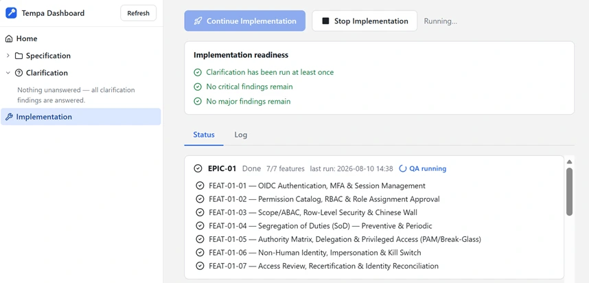
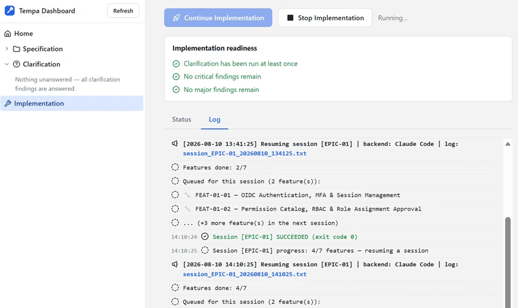

# Tempa — Agentic Coding Automation Harness

[](https://github.com/daus95/tempa/actions/workflows/tests.yml)
[](https://github.com/daus95/tempa/releases)
[](LICENSE)

> Turn a spec into a working app — clarified, planned, implemented, and QA'd
> automatically, while you do something else.

Turning a spec into working software usually means endless manual back-and-forth:
clarifying vague requirements, breaking the work into a plan, implementing it feature by
feature, and catching bugs before they pile up — one agent session at a time, babysat
from start to finish.

**Tempa automates that entire loop.** It drives an agentic coding CLI — **Claude Code**,
**GitHub Copilot CLI**, or **OpenAI Codex CLI**, your pick per stage — repeatedly and
unattended: clarifying your PRD until nothing critical is left ambiguous, drafting a plan
(epic → feature → task), implementing it, and running QA — start it once, walk away, and
come back to real progress instead of a blank terminal. It runs on whichever CLI's login
you already have (Claude, GitHub Copilot, or ChatGPT/OpenAI) — no separate per-token API
billing to provision or watch. See [Choosing a CLI Backend](#choosing-a-cli-backend) below.

Official repo: [github.com/daus95/tempa](https://github.com/daus95/tempa)

> Once set up, the recommended way to drive Tempa is the web **dashboard**
> (`tempa dashboard`) — see [Dashboard (Recommended)](#dashboard-recommended) below. Every
> dashboard action also has an equivalent CLI command (`tempa <command>`), for power users
> or scripting.

---

## Contents

1. [Quick Start](#quick-start)
2. [Setup (One-Time Only)](#setup-one-time-only)
3. [Choosing a CLI Backend](#choosing-a-cli-backend)
4. [Dashboard (Recommended)](#dashboard-recommended)
5. [Command Line Interface (CLI)](#command-line-interface-cli)
6. [Further Reference](#further-reference)

---

## Quick Start

> Already have Python 3 and an authenticated backend CLI installed (Claude Code, GitHub
> Copilot CLI, or OpenAI Codex CLI — Claude Code is the default)? This is the fast path.
> Missing one of those, or want the full explanation of each step? See
> [Setup (One-Time Only)](#setup-one-time-only) below instead.

1. **Download & extract** — [⬇ Download tempa.zip](https://github.com/daus95/tempa/releases/latest/download/tempa.zip)
   to a folder **outside** your project repo. Details:
   [Setup Step 2 — Download & Install](#step-2--download--install).

2. **Open the dashboard** — double-click **`Open Dashboard.cmd`** (Windows) /
   **`Open Dashboard.command`** (macOS) / **`Open Dashboard.sh`** (Linux) in that folder.

3. **Point Tempa at your project:** on the Home page, click **Select Working Folder** and
   pick your project folder — no terminal needed. (Linux: needs `zenity` or `kdialog`
   installed for the picker dialog — both ship by default on most desktop distros; if
   neither is installed, use the CLI fallback instead: from inside the extracted folder,
   run
   ```bash
   ./tempa init C:\repo\<your-repo>
   ```
   then reload the dashboard.)

4. **Follow the dashboard's checklist** — Upload Specification → Clarification → Start
   Implementation. See [Dashboard (Recommended)](#dashboard-recommended).

Prefer the terminal for everything? See
[Command Line Interface (CLI)](#command-line-interface-cli) for the full command-driven
workflow (`tempa init`, `tempa clarify`, `tempa implement`).

---

## Setup (One-Time Only)

> Done once per machine. Once this is done, the recommended way to do the recurring work
> is the [Dashboard](#dashboard-recommended) section below — power users can use the CLI
> [Command Line Interface (CLI)](#command-line-interface-cli) section instead (its first step points
> Tempa at your project).

### Step 1 — Prerequisites

1. **Python 3** installed (`py` / `python` on PATH).
2. **At least one agentic coding CLI** installed and on PATH — Tempa defaults every stage to
   **Claude Code** (`claude`), but you can point any stage at **GitHub Copilot CLI**
   (`copilot`) or **OpenAI Codex CLI** (`codex`) instead, or mix them. See
   [Choosing a CLI Backend](#choosing-a-cli-backend) below. The harness always runs its
   chosen CLI in fully automated mode (no human confirmation) — Claude Code via
   `--dangerously-skip-permissions`, Copilot via `--allow-all-tools`, Codex via
   `--dangerously-bypass-approvals-and-sandbox`.
3. Already logged in / authenticated with whichever of those CLI(s) you plan to use.

---

### Step 2 — Download & Install

Download the Tempa code as a ZIP file (no clone needed), then extract it to the folder you
want:

[⬇ Download tempa.zip](https://github.com/daus95/tempa/releases/latest/download/tempa.zip)

Put the extracted contents in a folder **separate from, and outside**, the repo you're going
to work on — don't put it inside your repo folder, so it doesn't get committed to your git
repo. Keep the whole folder together: the launcher puts `src/` on the import path and the
modules import each other by name, so nothing works if they're separated. For example, if
your repo is at `C:\repo\<your-repo>`, place Tempa as a sibling folder, e.g. `C:\tools\tempa`
or `C:\repo\tempa` (not `C:\repo\<your-repo>\tempa`). Full layout of what's inside that
folder: [docs/folders-and-paths.md](docs/folders-and-paths.md#the-tempa-install-folder).

Add that Tempa folder to your `PATH` so the `tempa` command works from anywhere:

- **Windows:** add the folder (e.g. `C:\tools\tempa`) to your user `PATH`, then open a new
  terminal. `tempa <command>` runs `tempa.cmd`, which calls `tempa <command>` internally.
- **macOS/Linux:** add the folder to your `PATH` (e.g. in `~/.zshrc` / `~/.bashrc`:
  `export PATH="$HOME/tools/tempa:$PATH"`), then open a new terminal. `tempa <command>` runs
  the `tempa` script, which calls `python3 tempa.py <command>` internally — no `chmod` needed,
  the executable bit is already set in the repo.

Prefer not to touch `PATH`? Run it directly from inside the Tempa folder instead. Every
`tempa <command>` in the rest of this README means one of these three — pick the line for your
setup:

```bash
tempa <command>            # PATH set (any OS)
./tempa.cmd <command>      # Windows, without PATH
./tempa <command>          # macOS/Linux, without PATH
```

Quickly check everything is ready before moving to the next step — it verifies the CLI backend
configured for the `implement` stage (Claude Code by default) can Write/Read/Delete a file:

```bash
tempa test                 # PATH set (any OS)
./tempa.cmd test           # Windows, without PATH
./tempa test               # macOS/Linux, without PATH
```

### No terminal? Double-click to open the dashboard

If you found the Tempa folder in Windows Explorer / macOS Finder / a Linux file manager and
would rather not open a terminal at all, double-click the launcher for your OS instead of
running `tempa dashboard`:

| OS | File | Notes |
|---|---|---|
| Windows | `Open Dashboard.cmd` | Double-click. A console window opens with the dashboard's log — that's normal, not an error. |
| macOS | `Open Dashboard.command` | Double-click. First run: right-click → **Open** once (Gatekeeper blocks unsigned scripts on a plain double-click), then double-click normally afterwards. |
| Linux | `Open Dashboard.sh` | Most file managers require marking it executable first — right-click → **Properties → Permissions → Allow executing** (or run `chmod +x "Open Dashboard.sh"` once from a terminal) — then double-click, or **Run** if prompted. |

Each one does exactly what `tempa dashboard` does and opens your browser to it. **Keep the
window that opens alongside your browser open** — that's the server; closing it stops the
dashboard. If Python isn't installed, the window explains that and waits so you can read it.

---

## Choosing a CLI Backend

Tempa doesn't run its own model — it drives an existing agentic coding CLI on your machine.
Three are supported, and every stage (Clarification / Planning / Implementation) picks its
own **independently** — so, for example, Clarification can run on Claude Code while
Implementation runs on OpenAI Codex CLI:

| Backend | CLI | Auth |
|---|---|---|
| **Claude Code** (default) | `claude` | Your Claude subscription login (`claude` → `/login`) |
| **GitHub Copilot CLI** | `copilot` | Your GitHub Copilot login (`copilot login`) |
| **OpenAI Codex CLI** | `codex` | Your ChatGPT/OpenAI login (`codex login`) |

Whichever you use must already be installed, on `PATH`, and logged in yourself — Tempa only
invokes it, it never manages credentials for you.

Set it per stage from the dashboard's **Settings → AI Models** tab (a dropdown next to each
stage's model field), or from the CLI:

```bash
tempa set-backend --clarify claude --plan copilot --implement codex
tempa show-backends
```

Each backend has its own model catalog, so changing a stage's backend usually means updating
that stage's model too (the dashboard's model field suggests options based on the backend
picked, but always accepts free text). Each stage also has an optional **Reasoning Effort**
setting, right next to the model field — its valid choices depend on the backend *and* model
picked (Codex varies per model; Claude/Copilot are uniform per backend), and Tempa rejects a
combination that CLI doesn't actually support:

```bash
tempa set-effort --implement high
tempa show-efforts
```

Full reference, including what happens to a resumed/interrupted session's history when a
stage's backend changes mid-epic and the exact reasoning-effort levels per backend/model:
see [docs/ai-models.md](docs/ai-models.md).

Not sure which of the three are actually usable on this machine? The dashboard's Home page
and Settings → **AI Models** tab both show a live ✅/⬜ **CLI backend availability** checklist
— installed on `PATH` and able to write to the current workspace — with a **Detect CLI
Backends** button there to re-check after installing or logging into one. See
[docs/cli-availability.md](docs/cli-availability.md).

The Settings page is organized into five tabs: **AI Models** (backend/model/reasoning effort
per stage), **Runs** (run limits, retry waits, poll interval, whether Tempa commits the
workspace to git after each epic passes QA, and whether processes a session leaves running
are terminated when it ends), **Guardrails** (what
clarification findings may block Finalized Clarification and Start Implementation),
**Notifications** (email alerts) and **Maintenance** (updates, restart server). One **Save
Settings** button at the bottom writes every tab at once, and it stays visible while you
scroll — it tells you when there are unsaved changes, including on a tab you're not looking
at.

---

## Dashboard (Recommended)

> Prefer the terminal, or need to script Tempa? Every action below has a matching CLI
> command — skip ahead to [Command Line Interface (CLI)](#command-line-interface-cli).

The dashboard walks you through the same specification → clarification → implementation
flow as the CLI, but with buttons, inline file editing, and live progress instead of
memorizing commands and flags. Start it with:

```bash
tempa dashboard            # PATH set (any OS)
./tempa.cmd dashboard      # Windows, without PATH
./tempa dashboard          # macOS/Linux, without PATH
```

This opens `http://127.0.0.1:<port>/` in your browser (`Ctrl+C` in the terminal stops the
server). If the project hasn't been set up yet, the **Home** page shows a
**Select Working Folder** button — click it to pick your project via a native dialog and
Tempa sets it up for you, no terminal involved. (Linux: needs `zenity` or `kdialog`
installed — see below. Without either, run `tempa init <path>` from the CLI once instead,
then reload the dashboard.)


The Home page is a 3-step checklist; each step unlocks once the one before it is satisfied.
Above it sits one optional card you can ignore entirely:

```
┌╌╌╌╌╌╌╌╌╌╌╌╌╌╌╌╌╌╌╌╌╌╌╌╌╌╌╌┐
╎  Architecture Principles  ╎  (optional — skip straight to step 1)
└╌╌╌╌╌╌╌╌╌╌╌╌╌┬╌╌╌╌╌╌╌╌╌╌╌╌╌┘
              │
              ▼
┌───────────────────────────┐
│  1. Upload Specification  │
└─────────────┬─────────────┘
              │
              ▼
┌───────────────────────────┐
│  2. Clarification         │  (Start Clarification → answer → Apply Answers → repeat)
└─────────────┬─────────────┘
              │
              ▼
┌───────────────────────────┐
│  3. Start Implementation  │
└───────────────────────────┘
```

| Dashboard step | Equivalent CLI step |
|---|---|
| **Select Working Folder** button (prerequisite, not shown above; Linux needs `zenity`/`kdialog` — see below) | [Step 1 — Initial Setup](#step-1--initial-setup) (`tempa init <path>`) |
| [Step 1 — Upload Specification](#step-1--upload-specification) | [Step 2 — Write the specification](#step-2--write-the-specification) |
| [Step 2 — Clarification](#step-2--clarification) | [Step 3 — Answer clarifications](#step-3--answer-clarifications-clarify) (`tempa clarify`) |
| [Step 3 — Start Implementation](#step-3--start-implementation) | [Step 4 — Run implementation](#step-4--run-implementation-implement) (`tempa implement`) |

### Architecture Principles (optional)

Tempa runs your project through several separate agent sessions — clarification, planning,
implementation, QA, verification — potentially on different CLI backends (see
[Choosing a CLI Backend](#choosing-a-cli-backend)) — and none of them remembers the previous
one. **Architecture Principles** is where you write the rules that should hold across all of
them: which database you
use, whether an ORM is allowed, how API errors are shaped, what has to be true before code counts
as done. Tempa prepends them to *every* prompt it sends, so the same rules stay in force
everywhere instead of each session falling back on generic defaults.

Click **Set / View Principles** on the card (or the sidebar entry) to open a free-form Markdown
editor, plus a **Learn more** page with worked examples and the mistakes to avoid. Saving an empty
box removes the principles again.

This is entirely optional — leave it empty and Tempa behaves exactly as it did before, with
nothing injected. Full reference: [docs/architecture-principles.md](docs/architecture-principles.md).

### Updates

Settings → **Maintenance** has an **Updates** card showing your installed version against the
latest published GitHub release. Click **Check for Updates** to refresh that comparison, and
— only when a newer release actually exists — **Update Now** to download and apply it in
place, no terminal needed. After a successful update, restart the running `tempa
dashboard`/`tempa implement` process (not just reload this page) so it picks up the new
code; the dashboard tells you this explicitly once the update finishes. Full reference:
[docs/updates.md](docs/updates.md).

### Step 1 — Upload Specification

Click **Add File** or **Add Folder** to upload your PRD/spec documents straight from the
browser (they land in the same `sources.prd` folder `tempa init` created). Uploaded files
appear under **Specification** in the left sidebar — click one to **View** it as rendered
markdown, or switch to **Edit** and **Save** to change it right there, no separate editor
needed. Right-click a file or folder in the sidebar for **Rename** / **Delete**. You can upload
more than one file — Tempa reads all of them together during clarification and planning.

Only upload the **new** specification you want implemented here — not old/already-implemented
ones. Specifications for the **existing** system belong separately in the `sources.docs`
folder (default `docs/`), not here: plan drafting uses `docs/` (and the code) as a reference
for "what already exists", so it doesn't duplicate work that's already done.

The new specification should ideally cover:

- **Purpose of the application** — what problem it solves, for whom.
- **Business process** — the workflow/steps the system needs to support.
- **Data model** — the main entities and their relationships.
- **UI concept** — a picture of the pages/interactions you want.
- **Tech stack** you want (language, framework, database, etc).

The more completely these five aspects are written up, the closer the resulting application
will match what you actually want. Full reference, with worked examples and common mistakes:
[docs/writing-a-spec.md](docs/writing-a-spec.md) (also linked as **What should go in here? →**
next to Add File/Add Folder on the dashboard's Upload Specification step).

Not sure how to start, or just want to try Tempa out first? The [examples/](examples/)
folder has ready-to-use sample PRDs (from a simple client-side app to a full web app with a
database) — upload them here via **Add File**/**Add Folder**, or copy them straight into
`.tempa/specs/prd` — see [examples/README.md](examples/README.md).

### Step 2 — Clarification

**Start Clarification** runs one evaluation pass and lists every finding (critical/major/
minor), grouped by file, under **Clarification** in the sidebar. Open a file to answer its
findings inline: for each finding, choose **Follow the recommendation** or **I'll write my
own answer** (a text box appears), then **Save**. Once clarification has run at least once,
the button relabels to **Continue Clarification** (with a hint explaining what's still
blocking it, if anything is) for the rest of this loop. While a run is in progress the button
swaps to **Stop Now** — click it (after a confirmation prompt) to cancel it early, the same
process-tree kill Step 3 uses. Its chevron offers **Stop After Current Session** instead: the
evaluate session finishes and records its findings, and nothing you've already paid tokens for
is thrown away. See [Two ways to stop](#two-ways-to-stop) below.

**You don't have to apply before continuing.** Saved answers are carried into every
subsequent round as already-decided resolutions — the **Pending resolutions** card shows how
many are waiting — so the loop is simply evaluate → answer → evaluate, with no full PRD
rewrite in between. Only findings you haven't answered yet hold up the next round.

**Apply Answers** writes those resolutions into the PRD/spec whenever you want the documents
themselves brought up to date. It's required once, before **Start Implementation** in Step 3:
implementation reads the PRD, so decisions living only in a clarification file would be
invisible to it. It auto-chains through the backlog one file at a time until everything's
applied, so one click finishes the job; while it's running the button swaps to **Stop Now**,
with **Stop After Current Session** on its chevron — that one lets the apply session in flight
finish and stamp what it wrote, then skips the remaining files.
See [docs/clarify-modes.md](docs/clarify-modes.md#pending-resolutions-overlay) for the
details.

The page splits into an **Overview** tab (the Unanswered/Fully answered file tables below)
and a **Log** tab (raw console output for whichever run is in progress) — same pattern as the
Implementation page's Status/Log tabs (see Step 3 below). The run buttons and readiness
panels above them stay visible regardless of which tab is open, with a spinning status badge
next to the buttons showing live clarify/apply/finalize progress either way.


**Answer manually during the early iterations** (usually the first 3–4 rounds): early on,
the system doesn't yet have enough project context to guess your intent accurately — its
recommended answers can still be off. Important decisions (application purpose, business
process, tech stack, etc.) need your direct input first, so the PRD starts off pointed in
the right direction.

**Finalized Clarification** automates the rest of that loop (evaluate + answer, repeating
until clean, then one apply and one verification pass) — click it to let Tempa finish off any
remaining major/minor findings on its own. It only becomes clickable once the **Finalize
readiness** panel above it is fully satisfied (and no clarify run is already in progress):

- Clarification has been run at least once.
- The latest result came from **Start Clarification** itself, not just **Apply Answers** —
  applying edits the PRD, not the finding record, so a fresh evaluation is what actually
  confirms nothing critical is left.
- That evaluation shows 0 critical findings.
- What backlog is left. Unanswered findings get filled in with their own recommendation
  before the loop starts; anything already answered is carried into every round and written
  into the PRD by the single apply at the end. This line is informational only, not part of
  the gate above — a backlog isn't something you have to clean up by hand beforehand.

Settings → Guardrails tab → **Allow finalizing with critical findings** switch
(`allow_finalize_with_critical` in [docs/config-json.md](docs/config-json.md)) waives all
three requirements above, not just the critical-findings one — with it on, **Finalized
Clarification** is clickable even before clarification has ever been run once, since its
own evaluate/answer/apply loop is what establishes and then resolves the finding set,
unsupervised.

**When to switch to Finalize:** after a few manual rounds, once you notice the system's
recommended answers over the last 2 iterations are already consistent/accurate with what you
intend (this usually starts showing around iteration 4 or 5) — by that point it has enough
context (from the PRD plus prior answers) that its recommendations can be trusted, and
continuing manually would just repeat the same outcome.

Finalize stops as soon as there are no more critical/major findings — some minor findings
may still remain, and that's **fine**: they'll be resolved anyway during implementation
(Step 3 below). So once it finishes, you can move straight on to implementation without
chasing down remaining minor findings.

This can take a while — Finalize repeats the evaluate → answer cycle on its own until
clean, which can mean several rounds depending on how much the PRD still needs resolving.
Switch to the **Log** tab to watch it live (running status plus streamed console output) so
you can tell it's still working rather than stuck. **Finalized Clarification** swaps to a
**Stop Now** button while it runs — click it (after a confirmation prompt) if you want to
cancel mid-way. Its chevron offers **Stop After Current Round**, which lets the round in
progress finish and exits from a clean, resumable boundary instead.

**Running out of tokens doesn't break the run.** If the configured backend's usage/session
limit is hit mid-way — during **Start Clarification**, **Apply Answers**, **Finalized
Clarification**, or **Start Implementation** in Step 3 below — the run doesn't fail. The
log reports that it's pausing ("this is not an error"), waits **30 minutes** for the limit
to reset, then continues automatically — repeating for as long as the limit is still in
effect. Nothing is lost while it waits: answers, applied resolutions, and epic/feature
progress all live in files + `config.json`, so it picks up exactly where it left off rather
than starting over. This is built into `tempa clarify`/`tempa implement` themselves, so it
works the same way whether you're running them from the CLI or through the dashboard (which
just runs those same commands as a background process) — just leave it running. An
**authentication** failure is different — that one stops immediately, since only
re-authenticating can fix it.

### Step 3 — Start Implementation

Once the most recent clarification evaluation satisfies the configured requirement,
**Start Implementation** unlocks (on the Home page, the **Clarification** overview, and the
**Implementation** section) — click it to run the same automated plan → implement → QA loop
as `tempa implement`. By default that requirement is **no critical and no major findings**,
but Settings → Guardrails tab → **Start Implementation requires** can relax it to *no
critical findings* (majors carried into implementation) or to *no condition* at all — see
`implementation_start_requirement` in [docs/config-json.md](docs/config-json.md). Either
way, clarification must have been run at least once: a workspace with no clarification file
yet has zero findings simply from having nothing to count, which would otherwise satisfy
every level trivially. **Every answer must also have been applied to the PRD** — implementation
reads the PRD documents, so a decision that only exists in a clarification file would be
invisible to it. That condition holds at every setting level, including *no condition*; if
it's the only thing blocking, the button explains exactly that and **Apply Answers** clears
it. The requirement is enforced server-side too, not just by a greyed-out
button, so it holds for the dashboard regardless of what the page shows. The
**Implementation** section's
**Status** tab shows live epic/feature progress and QA results; **Log** shows the raw
console output — any `session_*.txt`/`qa_*.txt`/`process_*.txt` filename it mentions is
clickable and opens that file in a viewer modal, see [docs/logging.md](docs/logging.md);
**Stop Now** is available while it's running.

#### Two ways to stop

Every Stop button is a split button: the main half stops immediately, the chevron next to it
offers the patient option.

- **Stop Now** kills the runner and the backend CLI it spawned, right away. Whatever the agent
  session in flight had worked out but not yet written is lost. Use it when you need the machine
  back now.
- **Stop After Current Session** (**…Current Round** for Finalized Clarification) leaves a
  request instead. The session already running finishes and records its work as usual, and then
  nothing new starts — so none of the tokens you've already spent are wasted, and the run resumes
  from a clean boundary. While it's pending the status reads *Stopping after current session…*,
  and the chevron offers **Cancel Graceful Stop**; **Stop Now** still works throughout, so asking
  to stop politely never traps you into waiting.

Both are available from the terminal too, and it's the same request either way — `tempa implement
--stop-graceful` stops a run you started from the dashboard, and the dashboard shows a request you
made in a terminal:

```bash
tempa implement --stop-graceful          # stop after the session in progress finishes
tempa implement --stop-graceful-cancel   # changed your mind
tempa clarify --stop-graceful            # same, for Apply Answers / Finalized Clarification
```





**Commit after QA pass** (on by default — Settings → Runs tab → "Version Control") has Tempa
`git commit` the workspace right after each epic's QA verdict lands as a genuine pass, so a
long unattended run leaves a checkpoint per verified epic instead of one giant uncommitted
diff at the end. It's skipped silently (logged, not an error) if the workspace isn't a git
repository or there's nothing to commit; turn it off if you'd rather commit by hand. See
`commit_after_qa_pass` in [docs/config-json.md](docs/config-json.md).

**Terminate leftover processes** (on by default — Settings → Runs tab → "Process Cleanup")
ends whatever a session left running when that session finishes — the dev server it started
to check its own work, a file watcher, a build daemon, a test runner — instead of leaving it
orphaned. Agent CLIs start long-running commands routinely and don't reliably stop them: in
one workspace a `vite` dev server was still holding its port 5.4 hours after the session that
started it had finished, alongside 15 idle build workers holding 1.9 GB between them. Each
session's CLI runs inside a container the operating system tears down with it — a Job Object
on Windows, a process group on Linux and macOS — so the session's whole process tree goes,
not just the CLI. It never asks what a process is, only who started it, so this works the
same whatever your project is built with. Anything genuinely detached (a Docker container, an
installed service) is out of scope. Turn it off only if you want a session's processes to
outlive it — nothing else will clean them up. See `terminate_leftover_processes` in
[docs/config-json.md](docs/config-json.md).

Once any epic has actually run, the button relabels itself to **Continue Implementation** —
the run resumes the existing plan rather than starting anything — and clicking it resets any
epic left in the `failed` state back to `pending` first (the same thing
`tempa implement --reset-failed` does), then continues. Without that, a single failed epic
would make every click halt on the spot, since `implement` refuses to work past one. See
[docs/start-implementation.md](docs/start-implementation.md).

**Clear All**, at the bottom of Home, deletes all plan/QA/log/clarification results
(your specification files are never touched) — useful for restarting the clarification or
implementation loop from scratch. This cannot be undone.

The **✕** next to the working-folder path (top of Home) detaches the current project (same
as `tempa close-folder` on the CLI) — no files are deleted, it just drops the link so you can
point Tempa at a different project next. The current project's config/history stays in its
own `.tempa/` folder, ready to resume if you point Tempa back at it later.

> The folder picker and "open in explorer" work on Windows and macOS out of the box. On Linux
> they rely on `zenity`/`kdialog` (picker) and `xdg-open` (file manager) — all three ship by
> default on most desktop distros, though `xdg-open` there only opens the folder, it doesn't
> force that window to the foreground the way Explorer/Finder do. Without any of those tools
> installed, set the working folder with `tempa init <path>` (CLI) first, then use the
> dashboard normally for the rest of the workflow — the **✕** icon works there too.

---

## Command Line Interface (CLI)

> Prerequisite: the **Setup (One-Time Only)** section above has been done. This is the
> CLI/power-user path — the [Dashboard](#dashboard-recommended) above runs this exact same
> workflow through buttons and inline forms instead.

```
┌───────────────────────────┐
│  1. Initial Setup         │
└─────────────┬─────────────┘
              │
              ▼
┌───────────────────────────┐
│  2. Write Specification   │
└─────────────┬─────────────┘
              │
              ▼
┌───────────────────────────┐
│  3. Answer Clarifications │  (loop: evaluate → answer → apply, until clean)
└─────────────┬─────────────┘
              │
              ▼
┌───────────────────────────┐
│  4. Run Implementation    │  (loop per epic: feature → QA → fixes)
└───────────────────────────┘
```

### Step 1 — Initial Setup

Point Tempa at the project you want to work on with `init`, passing the (absolute) path
to your project folder:

```bash
tempa init C:\repo\<your-repo>
```

This command will:

- Make this project the active workspace, and save its config to
  `<your-repo>\.tempa\config.json` (reused as-is if you've pointed Tempa at this project
  before — otherwise created fresh).
- Create the standard working folders in your project if they don't already exist — one of
  them being the `specs` folder (kept inside `.tempa/`), where you'll place the specification
  you want to work on.

> Run this once per project. Safe to re-run — folders that already exist on disk are not
> re-created, and their contents are never overwritten.

What you need to know at this point: **put your new specification in the `specs` folder**
(default: `.tempa/specs/prd`) inside that project. Full details on the working-folder
structure and AI model configuration are in
[docs/folders-and-paths.md](docs/folders-and-paths.md) and
[docs/ai-models.md](docs/ai-models.md) — not required reading to get started.

Optionally, set your project's **Architecture Principles** — rules Tempa applies to every stage
that follows (see [Architecture Principles](#architecture-principles-optional) above). They're
edited in the dashboard; from the CLI you can read the current value with:

```bash
tempa show-principles
```

### Step 2 — Write the specification

Save it in the `sources.prd` folder (default `.tempa/specs/prd`) — and **only** that: the
**new** specification you want implemented. Don't put old/already-implemented specifications
here.

For what it should ideally cover, which specs belong in `sources.docs` instead, and
ready-to-use example PRDs to start from, see
[Dashboard Step 1 — Upload Specification](#step-1--upload-specification) above — the
guidance is the same regardless of how you get the file there.

### Step 3 — Answer clarifications (`clarify`)

The goal: the system asks about anything ambiguous/unclear in the PRD, you answer, and those
answers get applied back into the PRD — repeated until there are no more `critical`/`major`
findings. There are two ways to answer; both are used in sequence as part of the same flow,
not as alternatives to pick from. For when to use which, see
[Dashboard Step 2 — Clarification](#step-2--clarification) above — the reasoning is the same
regardless of interface.

#### A. Answer manually

```bash
tempa clarify          # evaluate: system writes questions + recommended answers to a file
```

Once the evaluation finishes, Tempa opens the **clarification-answer web UI** on the result
file so you can answer right there (add `--noui` to skip it). Clicking **Save** asks whether
to also start the next clarification round right away (**Save & Clarify**) or just save the
answers for now (plain **Save**) — either way they're carried into the next round; **Save &
Clarify** just skips the trip back to the overview to kick it off. Writing the answers into
the PRD itself is a separate step, done from the dashboard's **Apply Answers** button (see
[Dashboard Step 2 — Clarification](#step-2--clarification) above) or `tempa clarify --apply`.

Prefer editing the markdown file by hand instead? That still works: edit the result file
yourself, then run `tempa clarify --apply` to apply it back into the PRD — run this way,
directly from a terminal, Tempa asks whether to run another clarification round right away
(`y`/`N`; only asked in an interactive terminal, non-interactive runs just exit). Re-open the
UI anytime with `tempa answer` — no file argument needed: it scans
`sources.clarifications` for every result file and, as long as at least one still has an
unanswered finding, opens them **all** at once (one tab per file, badged complete/incomplete)
so you never have to hunt down which file still needs an answer.

#### B. Answer automatically (`--finalize`)

```bash
tempa clarify --finalize
```

Runs evaluate + answer + apply in a single automatic loop until clean, without you having to
answer one by one anymore.

Full reference for every mode (`clarify` manual, `--auto-answer`, `--apply`, `--finalize`):
see [docs/clarify-modes.md](docs/clarify-modes.md).

### Step 4 — Run implementation (`implement`)

```bash
tempa implement
```

Just run this. The system will (automatically, unattended): draft a plan if there's no task
yet → implement features one by one → run QA once an epic is done → fix any findings →
move on to the next epic, until everything is done.

**A backend hiccup does not stop the run.** If the AI provider's own API fails to process a
request because it is temporarily overloaded (Anthropic's transient **529 Overloaded**),
Tempa treats it as a pause rather than a failure: it logs that it's waiting, sits out a
short delay (5 minutes by default), then retries the interrupted epic/QA automatically —
the same way it waits out a usage limit (30 minutes by default). Since the epic being
worked on is left resumable, the retry continues where it left off instead of starting the
epic over. These wait durations, along with the agent runner's poll interval, are
configurable from dashboard Settings → Runs tab → "Retries & Timing" card.

Before that retry resumes, Tempa also resets any epic the interrupted session left marked
`failed` in `config.json` back to `pending` — exactly what `tempa implement --reset-failed`
does by hand. This matters because `failed` is sticky and blocking: the runner deliberately
halts on a failed epic (`Halted — session [x] at index i has failed`), so without the reset
a single 529 could leave every later poll — and every later `tempa implement` run — failing
on that stale status even though nothing was actually broken. A **real** failure still stops
the runner and still keeps its `failed` status, so it stays visible for you to look at; in
that case fix the cause and run `tempa implement --reset-failed` yourself before continuing.

**Nor does a backend CLI that finishes but never exits.** If the CLI signals its turn is
complete but the process itself hangs afterward (e.g. stuck in its own cleanup), Tempa
force-terminates it after a 120-second grace period instead of waiting forever — and since
the epic/QA state already reflects everything that session did, this isn't treated as a
failure either; the run just resumes automatically. See
[docs/start-implementation.md](docs/start-implementation.md).

**A plan that schedules an epic before something it actually depends on doesn't get stuck
either.** If an epic keeps resuming without completing another feature, Tempa asks the
backend CLI which specific epic it's blocked on and, when it's safe to (the named epic
exists, isn't already done, and reordering it wouldn't just reverse an earlier move), moves
that dependency ahead of the stuck epic in the plan automatically — so the scheduler works on
the real blocker next instead of endlessly re-resuming an epic that can't proceed. When it
can't fix this on its own (most notably a genuine circular dependency between two epics), the
epic is marked `failed` with the session's own explanation shown right on the dashboard's
Status tab and in `tempa status`, for a human to resolve.

Full details (the `--replan`/`--features` flags, work priority, monitoring progress,
recovering from problems, manual verification): see
[docs/start-implementation.md](docs/start-implementation.md).

---

## Further Reference

> Not required reading to get started — see the Dashboard or Workflow above
> first.

- **Architecture** — how Tempa's own codebase is put together (module map, CLI/dashboard
  boundary), for anyone contributing to it: [docs/architecture.md](docs/architecture.md)
- **Folder & Path Structure** — what a working folder is, `workspace.*`, `sources.*`:
  [docs/folders-and-paths.md](docs/folders-and-paths.md)
- **Writing a Specification** — what a good PRD covers, worked examples, common mistakes:
  [docs/writing-a-spec.md](docs/writing-a-spec.md)
- **Architecture Principles** — project-wide rules injected into every stage, how to write them:
  [docs/architecture-principles.md](docs/architecture-principles.md)
- **AI Backend & Model per Stage** — Claude Code / Copilot CLI / Codex CLI, why both are
  differentiated per stage, default table, how to change them:
  [docs/ai-models.md](docs/ai-models.md)
- **CLI Backend Availability** — how the dashboard's ✅/⬜ readiness checklist (Home +
  Settings → AI Models) is computed, what "ready" means, and the **Detect CLI Backends** button:
  [docs/cli-availability.md](docs/cli-availability.md)
- **Checking for Updates** — how the Settings page's Maintenance tab (and the CLI equivalents)
  check and apply new releases, and why a restart is required afterward:
  [docs/updates.md](docs/updates.md)
- **Command Reference** — full list of every command:
  [docs/command-reference.md](docs/command-reference.md)
- **`config.json` structure** — every key and what it does:
  [docs/config-json.md](docs/config-json.md)
- **Prompt templates** (the `src/prompt/` folder) — file list & how to customize harness behavior:
  [docs/prompt-templates.md](docs/prompt-templates.md)
- **Logs & output** — where logs for each session/stage live:
  [docs/logging.md](docs/logging.md)
