# Tempa Dashboard — Step-by-Step User Guide

> This guide walks you through using the **Tempa dashboard** from scratch: opening the
> dashboard, creating a new workspace, uploading a specification (PRD), running
> clarification until it's clean of critical/major findings, then running **Start
> Implementation** until the app is fully built and passes QA — with a screenshot at every
> step. Aimed at someone using Tempa for the very first time.
>
> Background on the concepts (what Tempa is, why you'd use it) lives in the root
> [README.md](../../README.md) — this guide is all **practice**, click by click, using a
> real example: a simple PRD ("Mortgage Installment Simulator") taken from spec to a
> finished, QA'd app.

## Table of Contents

1. [Prerequisites](#1-prerequisites)
2. [Opening the Dashboard](#2-opening-the-dashboard)
3. [Creating a New Workspace](#3-creating-a-new-workspace)
4. [Uploading a Specification (PRD)](#4-uploading-a-specification-prd)
5. [Clarification](#5-clarification)
6. [Start Implementation](#6-start-implementation)
7. [After Implementation Finishes](#7-after-implementation-finishes)
8. [Further Reading](#8-further-reading)

---

## 1. Prerequisites

Before you start, make sure you have:

1. **Python 3** installed and callable from a terminal (`python`/`py`).
2. **At least one agentic coding CLI** installed, on `PATH`, and **already logged in** —
   Tempa doesn't run its own model, it drives one of:
   - **Claude Code** (`claude`) — the default,
   - **GitHub Copilot CLI** (`copilot`), or
   - **OpenAI Codex CLI** (`codex`).
3. Tempa itself already downloaded/cloned into a folder **outside** the project you're
   about to work on (see the root [README.md](../../README.md), *Setup* section).

The dashboard shows the readiness of all three backends automatically (✅/⬜) as soon as
you open a workspace — you don't have to guess which one is ready.

---

## 2. Opening the Dashboard

From the Tempa install folder, run:

```bash
tempa dashboard            # if the Tempa folder is already on PATH
./tempa.cmd dashboard      # Windows, without PATH
./tempa dashboard          # macOS/Linux, without PATH
```

This starts a local server and prints its address, e.g.:

```
Dashboard: http://127.0.0.1:51167/
Press Ctrl+C to stop.
```

then automatically opens that address in your browser (leave this terminal window open —
it's the server; closing it stops the dashboard). If you've never opened a workspace
before, you'll see the **Home** page like this:

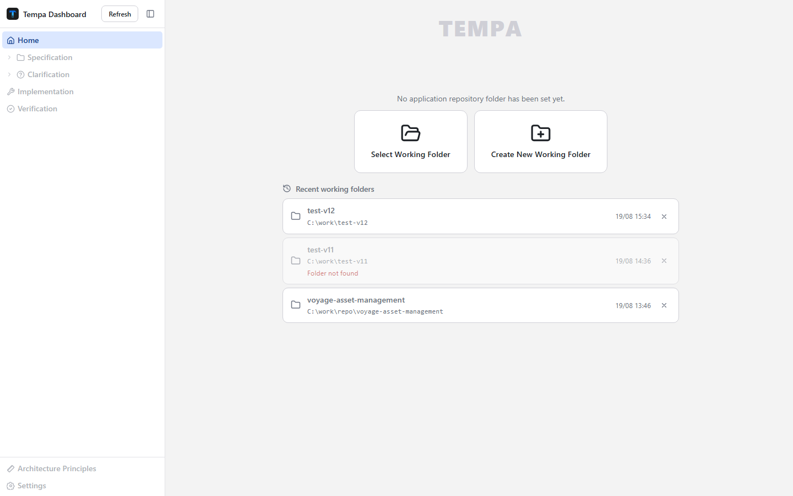

Below the two buttons is a **Recent working folders** list — workspaces opened before on
this machine (in the screenshot above, this happens to be a machine that was already used
for other projects; if this is genuinely your first time using Tempa, this list will be
empty).

---

## 3. Creating a New Workspace

There are two buttons on the Home page:

- **Select Working Folder** — pick a project folder that **already exists** (e.g. a repo
  you've already started).
- **Create New Working Folder** — create a **brand-new** project folder from scratch. This
  is the one we use in this guide.

Click **Create New Working Folder**. Tempa will:

1. Open your operating system's native folder picker (Windows Explorer / Finder /
   `zenity`/`kdialog` on Linux) — pick the **parent** folder where the new project should
   be created (e.g. `C:\work`).
2. Show a small dialog to type the new project folder's **name** (e.g.
   `tempa-demo-mortgage-app`).
3. Create that folder and immediately run `tempa init` inside it — setting up the standard
   working-folder structure (`docs/`, `src/`, `.tempa/` for Tempa's internal data, etc.).

> No folder dialog shows up? On Linux, this feature needs `zenity` or `kdialog`. Without
> either, run `tempa init <full-path>` from the CLI instead, then reload the dashboard
> page.

Once the workspace is created, the Home page changes: it now shows the active working
folder, the readiness of all three CLI backends, and the checklist for the next two steps
(Upload Specification, Clarification):

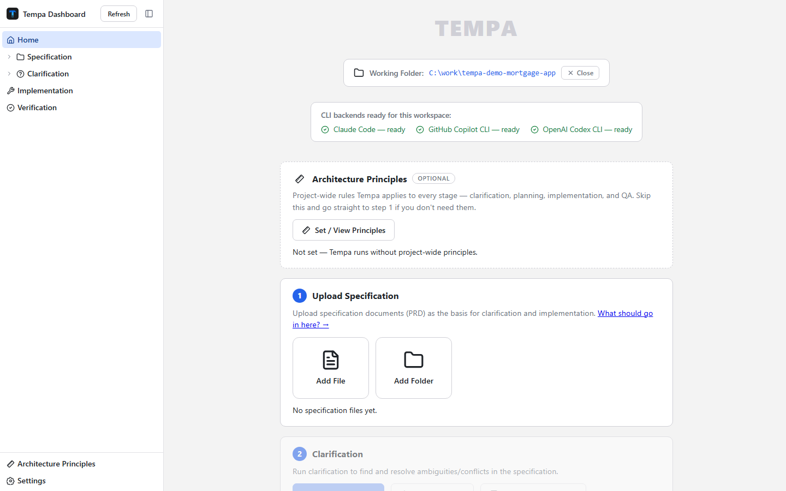

Notice the **CLI backends ready for this workspace** panel — here all three (Claude Code,
GitHub Copilot CLI, OpenAI Codex CLI) show **ready**, meaning Tempa can use any of them
(or all three at once, one per stage) for this workspace. If one of them isn't ✅ yet,
that doesn't block you — you just need to make sure whichever backend is configured for
the stage you're about to run (see Settings → AI Models) is actually ready.

---

## 4. Uploading a Specification (PRD)

A specification (PRD — *Product Requirements Document*) is the document that describes
what you want to build. The example used in this guide is a simple PRD for a **mortgage
installment simulator** (`examples/01-simple-web-app/PRD.md` in the Tempa repo) — a purely
client-side web app with no backend.

On the **1. Upload Specification** card, click **Add File** and pick your PRD file (you
can add more than one file/folder — Tempa reads them all together). Tempa shows a
confirmation before adding it:

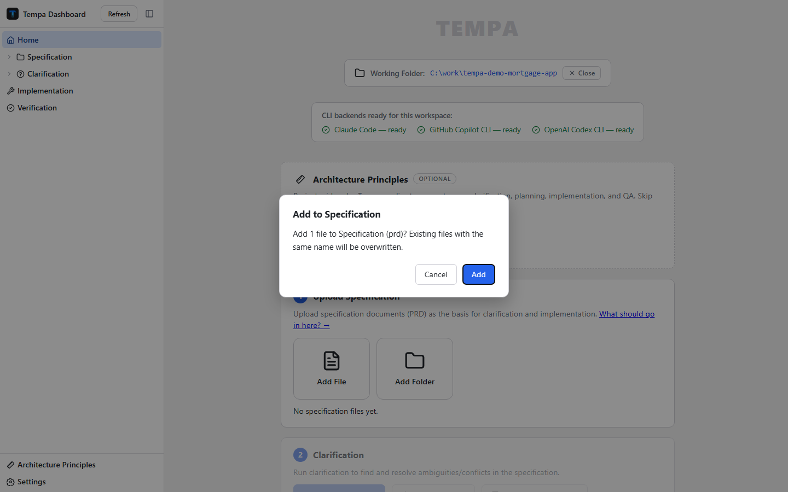

Click **Add**. The file immediately shows up in the left sidebar, under
**Specification**:

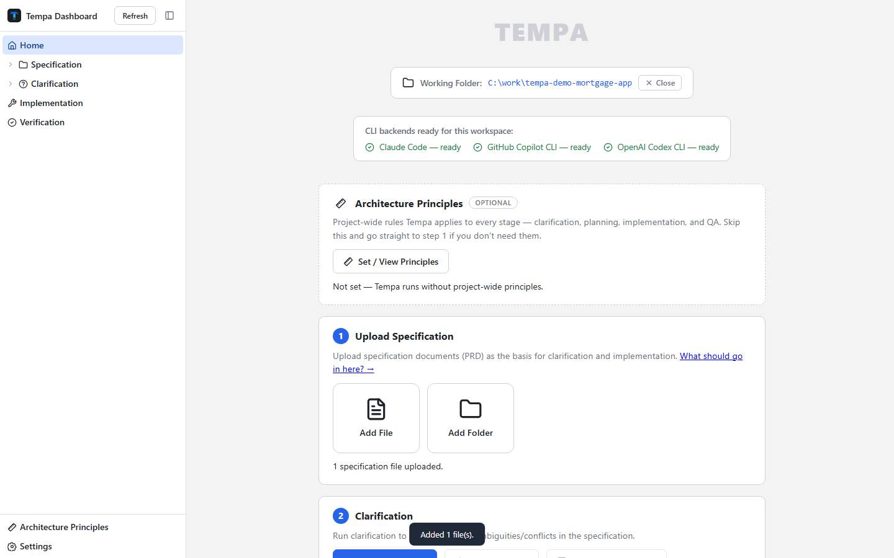

Click the filename in the sidebar (`PRD.md`) to open it:

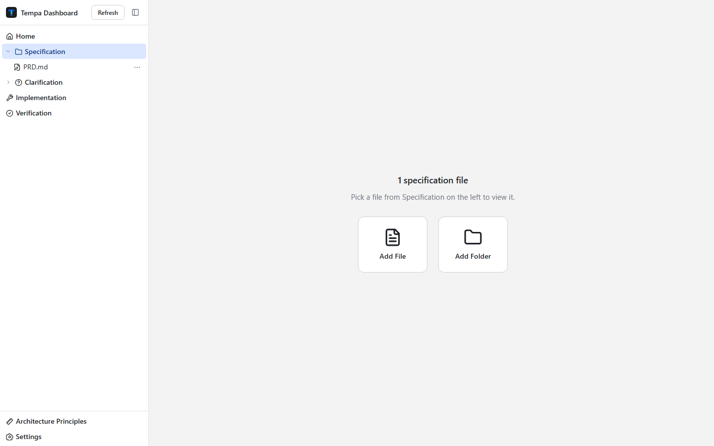

Click the file to see it rendered as **Markdown** — headings, bold text, numbered lists
all rendered neatly, not as raw text:

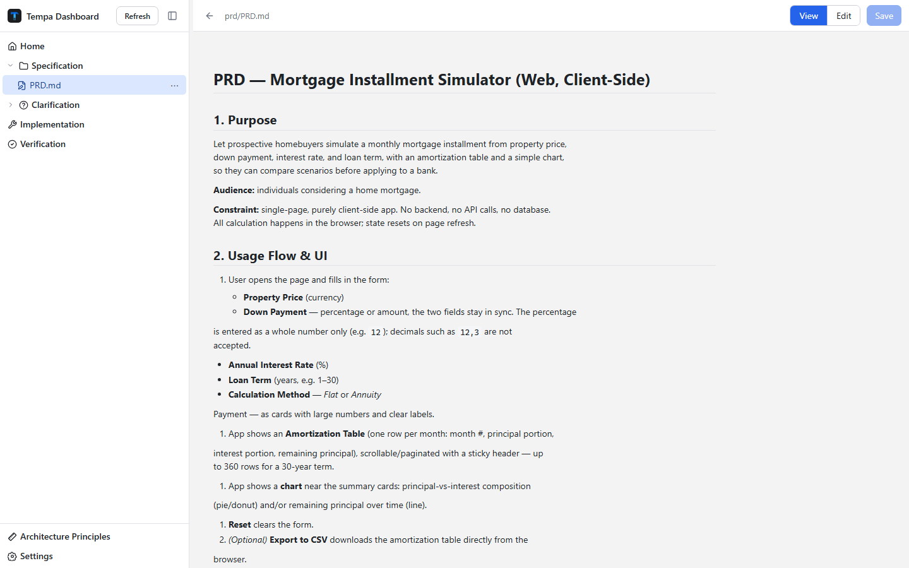

The **Edit** button opens a plain text editor to change the file straight from the
browser (then **Save** to save it) — no separate editor app needed. You can upload more
than one specification file; Tempa reads them as one combined document during
clarification and implementation.

> **Only upload the NEW specification** you want implemented here. Documentation for a
> system that **already exists** has a separate place (the project's `docs/` folder) so
> it never gets mixed up with, or causes Tempa to rebuild, something that's already done.

---

## 5. Clarification

This is the most important stage before implementation: Tempa **re-reads** your PRD and
looks for anything ambiguous, incomplete, or contradictory — before a single line of code
gets written.

### 5.1 Running the first evaluation

Scroll to the **2. Clarification** card, then click **Start Clarification**:

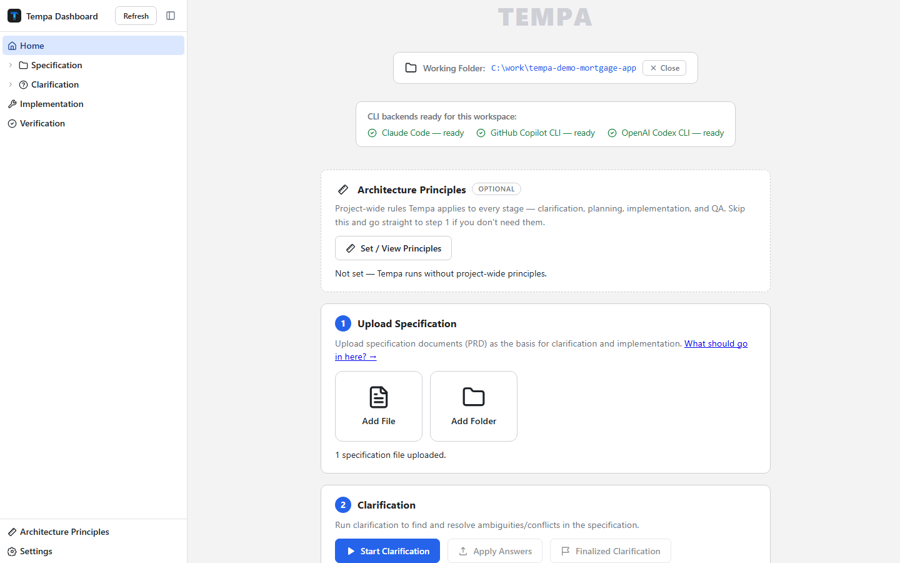

Tempa immediately calls the CLI backend configured for the Clarification stage (default:
Claude Code) to read the whole PRD. While this runs, the button turns into **Stop Now**
and a **Running…** indicator appears with the elapsed time and the number of finding
lines being written:

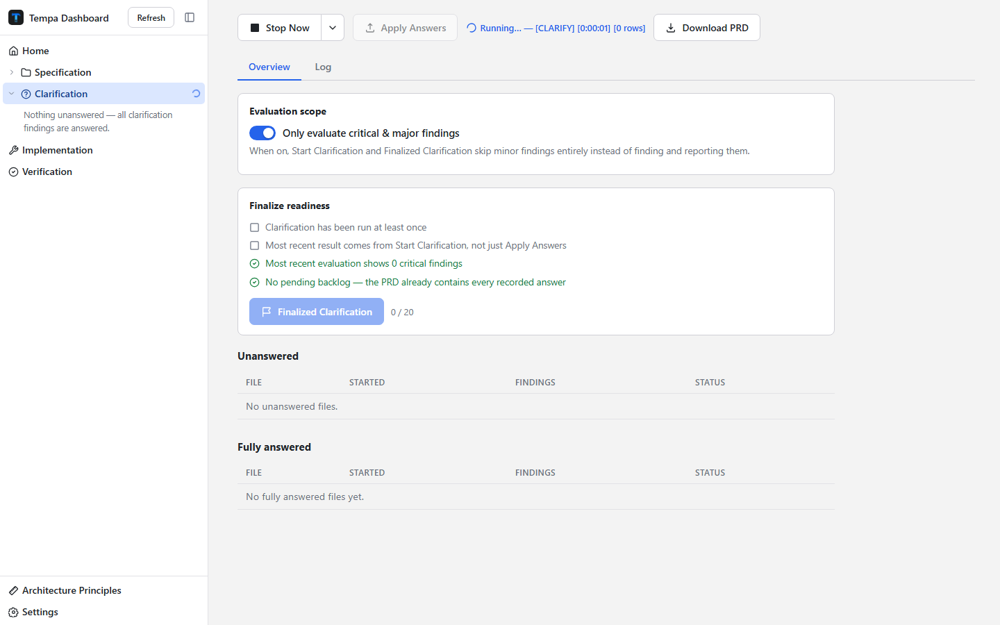

### 5.2 The Log tab

While the evaluation runs (or at any other time), click the **Log** tab to watch the raw
console output live — useful to confirm the process is actually working, not stuck:

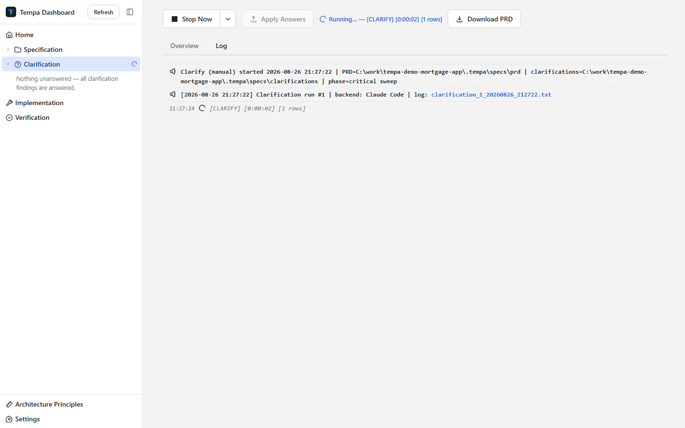

Any `log: filename.txt` line shown there **can be clicked** — it opens that session's log
file content in a pop-up viewer, no need to go find it manually under `.tempa/logs/`.

> **Why does the page sometimes need a refresh?** Tempa reads the file list from disk when
> the dashboard first loads, then caches it. If you happen to run something from a
> terminal at the same time (rare in normal usage), click the **Refresh** button top-left
> to rescan the working folder. In normal dashboard-only usage you'll never need to do
> this — every run/save button already refreshes the view automatically.

The first evaluation on our example took about 7 minutes and produced **7 findings, all
`critical`** (0 major, 0 minor) — normal for a PRD that's never been clarified before.
Also notice: Tempa **sweeps one severity to exhaustion first** (critical → major → minor)
instead of evaluating all three at once, so major/minor aren't evaluated against a PRD
that's still full of fundamental issues. Click **Refresh** top-left to reload the file
list, and the panel changes to:

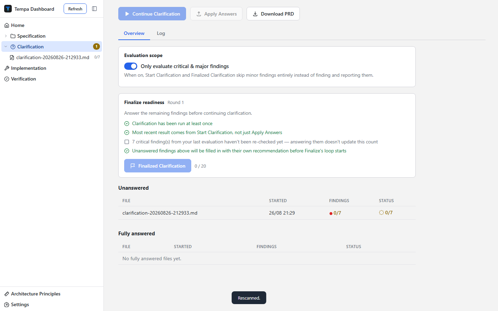

### 5.3 Answering findings

Click the clarification filename in the sidebar (`clarification-20260826-212933.md`) to
open the answer page. Each finding shows: a severity badge (**CRITICAL**/MAJOR/MINOR), a
short title, a **WHERE** section (the PRD reference), a description of the problem, a
**QUESTION**, and a **RECOMMENDATION** from the agent:

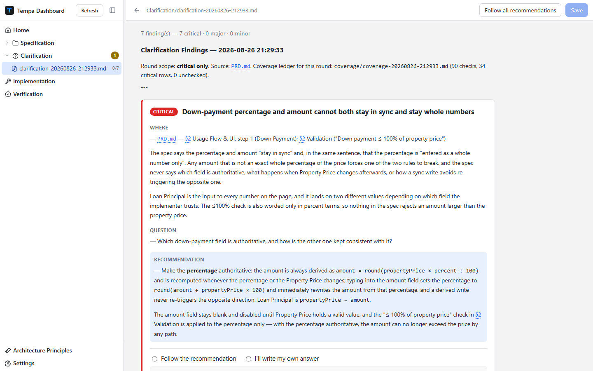

#### Opening the PRD reference from a finding

Look at the **WHERE** section — there are blue links like `PRD.md` and `§2`. Click one of
the section links (e.g. **§2**) to open a drawer on the right showing the **exact section**
of the PRD that finding refers to, auto-highlighted — no need to open the PRD file
separately and go hunting for it yourself:

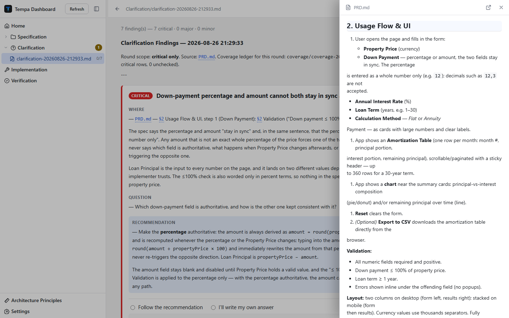

This drawer is read-only and modal (the page behind it stops responding while it's open)
— close it with **✕**, **Esc**, or a click outside it. The **⧉** button opens that file in
the full Specification editor if you want to edit it.

For every finding, there are two ways to answer:

- **Follow the recommendation** — use the agent's suggested resolution as-is.
- **I'll write my own answer** — opens a text box to type your own decision (use this
  when the agent's recommendation doesn't quite match what you actually want).

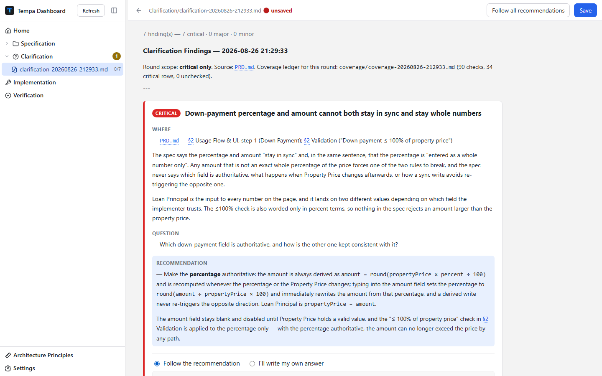

An example of writing your own answer for the second finding (pinning down which
annuity formula to use):

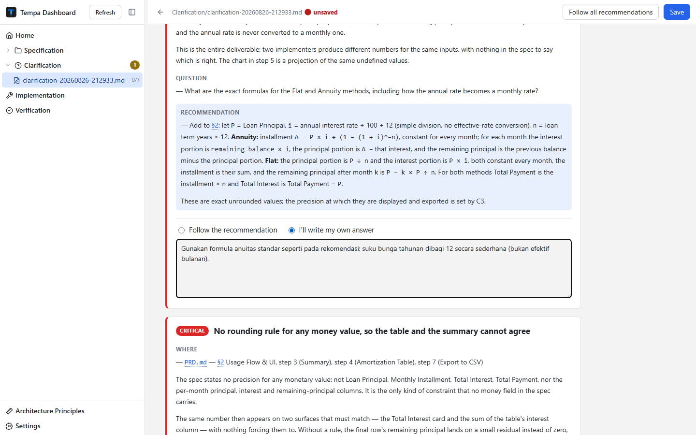

Instead of answering one by one, the **Follow all recommendations** button top-right
immediately sets "Follow the recommendation" for **every** finding that's still
unanswered (any answer you've already filled in by hand is kept as-is):

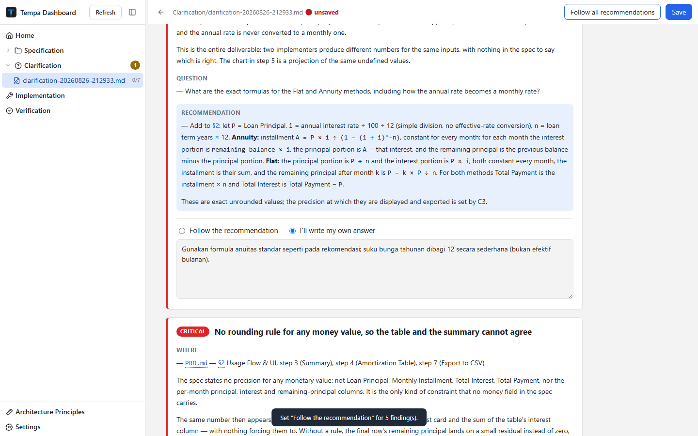

### 5.4 Save vs. Save & Clarify

Click **Save** top-right. Tempa offers three choices:

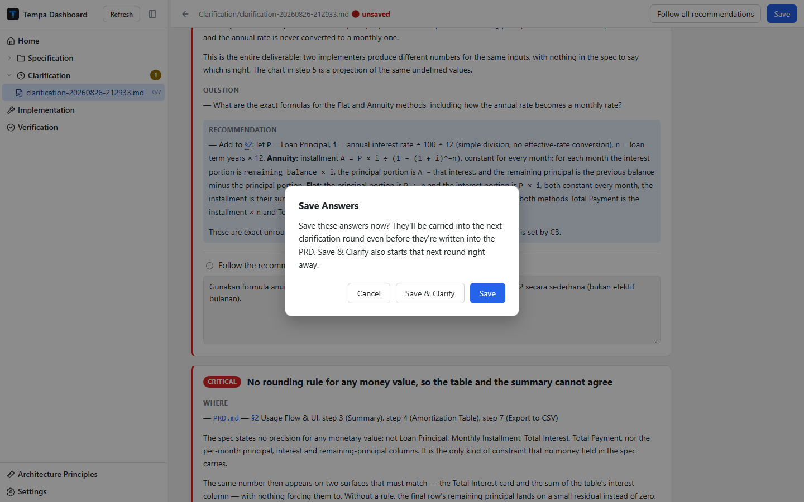

- **Save** — saves the answers to this clarification file only. They're carried forward
  automatically into the next evaluation round (the *pending resolutions overlay*) **even
  though they haven't been written into the PRD yet**.
- **Save & Clarify** — does the same as Save, then immediately runs **Continue
  Clarification** (the next evaluation round) without a trip back to the overview page.
- **Cancel** — discard, save nothing.

Important: answering **does not automatically change the PRD**. Answers are only actually
written into the PRD document once you click **Apply Answers** (see 5.8). Before that
apply step, they're still "taken into account" by every subsequent evaluation — so you're
**not required** to apply between every round; you can just keep answering until clean and
apply once at the end.

We pick **Save & Clarify** so round 2's evaluation starts right away.

### 5.5 Repeating until clean of criticals

After a few rounds, the Overview page shows **Pending resolutions** — a summary of how
many saved answers haven't been written into the PRD yet — plus a **Fully answered** table
for rounds that have been completely answered:

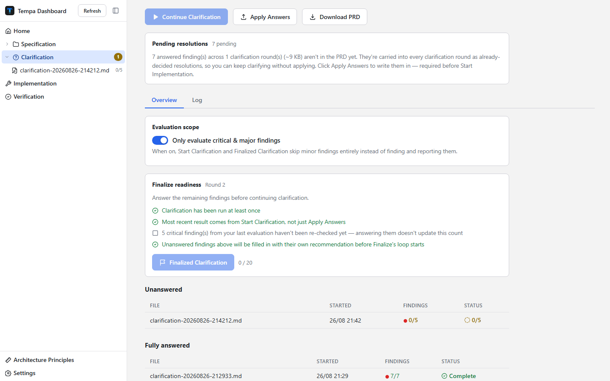

Keep repeating the same pattern — open the file, answer (**Follow the recommendation**,
write your own, or **Follow all recommendations** for the rest), then **Save & Clarify** —
until the evaluation's **critical** count reaches **0**. On this mortgage-simulator PRD,
the critical count per round went like this:

| Round | Critical found |
|---|---|
| 1 | 7 |
| 2 | 5 |
| 3 | 4 |
| 4 | 3 |
| 5 | 1 |
| 6 | 1 (a new finding, not a leftover) |
| 7 | 2 (new findings again) |

This is **normal**: every round re-reads the whole PRD plus every previous answer, so
sometimes a new problem only becomes "visible" once an earlier problem is considered
resolved — it doesn't mean an earlier round was wrong. What matters is the count trending
**down overall**, not dropping every single round without exception.

> **Tip:** For the first 3–4 rounds, it's best to answer **manually**, one at a time —
> especially for important decisions (the app's purpose, business process, tech stack).
> Early on, the agent's automatic recommendations may not yet match what you actually
> intend. Once its recommendations stay consistent over the last 2 rounds (this usually
> starts to show around round 4–5), you can switch to **Finalized Clarification** (5.6) so
> the rest runs unattended instead of you babysitting it one round at a time.

### 5.6 Finalized Clarification

Once the latest evaluation shows **0 critical findings** (major findings are still
allowed), the **Finalized Clarification** button unlocks on its own. It runs an automatic
evaluate → answer → evaluate loop until clean, then one **apply** and one **verification
evaluation** at the end — without you clicking anything else in between.

The **Finalize readiness** panel spells out exactly which requirements are/aren't met:

- Clarification has been run at least once.
- The latest result comes from **Start/Continue Clarification**, not just Apply Answers.
- The latest evaluation shows 0 critical findings.
- Any unanswered backlog will be auto-filled with its own recommendation before the loop
  starts (this line is informational only — not a requirement you have to clear first).

#### A shortcut (optional, advanced)

On our example, criticals kept bouncing around a small number (1–2) across several rounds
without ever quite hitting zero. Rather than keep waiting manually, we used the option
under **Settings → Guardrails → Allow finalizing with critical findings**:

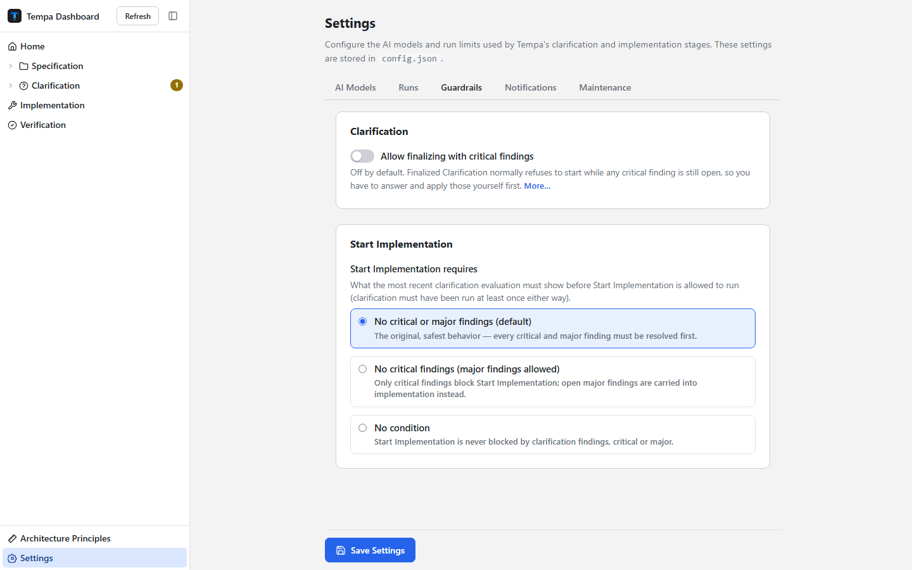

Turning it on shows a warning — **read it carefully before enabling it**, since this lets
the automated loop try to resolve critical findings **without your supervision**:

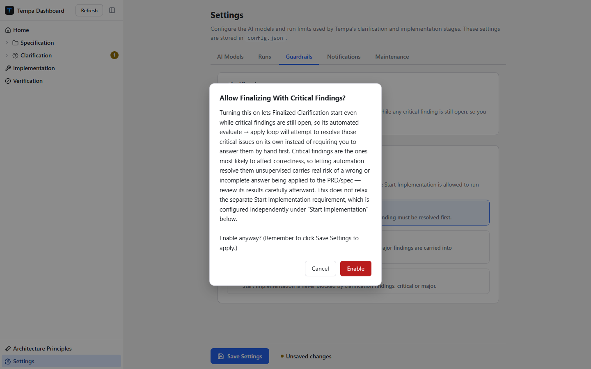

Once confirmed and **Save Settings** is clicked, the card shows the enabled state along
with its warning:

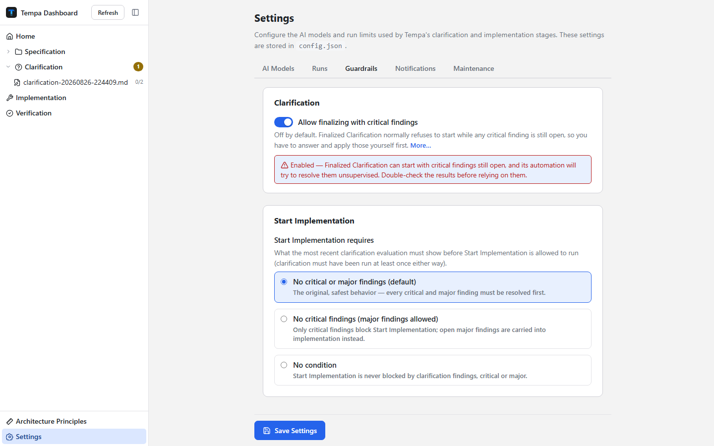

> **When this is appropriate:** only once you've already answered a few manual rounds and
> you're confident the remaining critical findings that keep cycling aren't a fundamental
> problem (usually small, interrelated nuances) — and you commit to **reviewing** the
> resulting PRD afterward. For a brand-new PRD that's never been answered at all, leave
> this option **off** (the default) and answer manually as in 5.3–5.5 above.

Back on the Clarification page, the **Finalize readiness** panel now marks the critical
line with a note saying **"allowed via the Settings override"**, and **Finalized
Clarification** is clickable even though the latest evaluation still shows critical
findings:

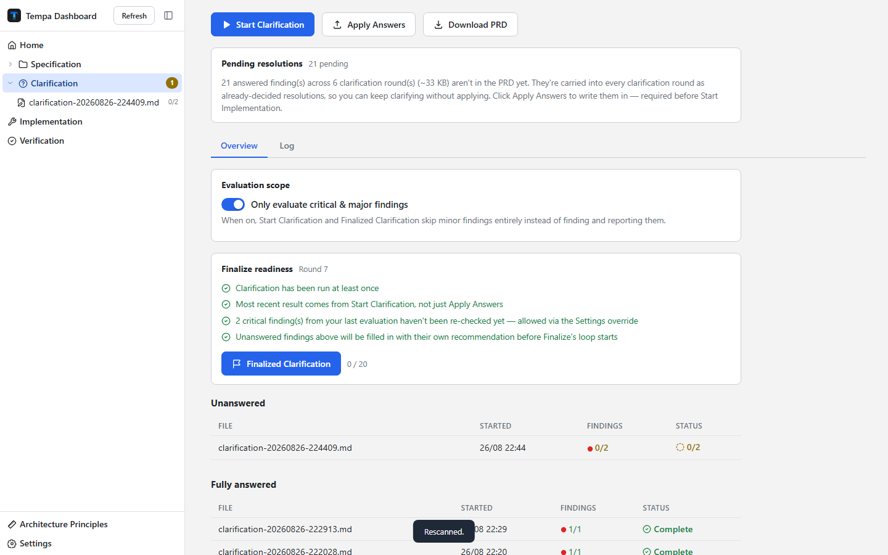

Click **Finalized Clarification**, then switch to the **Log** tab to watch it run — this
can chew through several rounds in one go (up to the **Max Finalize Clarification Round**
limit, default 20), so it's normal for it to take a while:

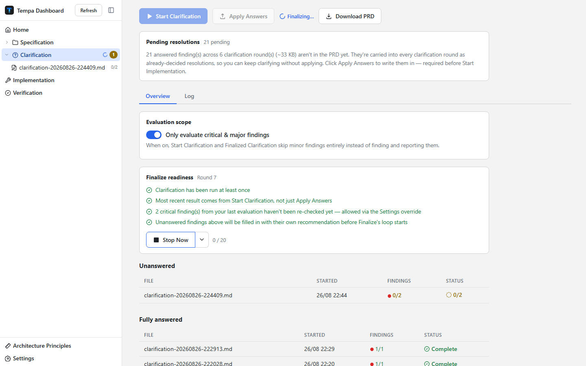

Finalize stops once **critical and major both reach zero** (minor findings may still
remain — they get handled later during implementation anyway). If Finalize finishes but
**major findings remain**, that means the "no-progress" guard kicked in (the agent stopped
making progress) — run **Finalized Clarification** again, or answer the remaining major
findings manually like the earlier rounds, then run Finalize again until it's truly clean.

#### Controlling how often the PRD gets written during Finalize

By default, Finalize keeps every answer in memory and only writes them into the PRD
**once, at the very end**. For a long unattended run, that means if something goes wrong
partway through, hours of agent work were never saved to the document at all. Settings →
Runs → **Finalize Checkpoints** controls how often (every how many answering rounds) Tempa
pauses to **apply** (write what's been answered so far into the PRD) and, if enabled,
**commit** — so a long-running process keeps a recoverable checkpoint:

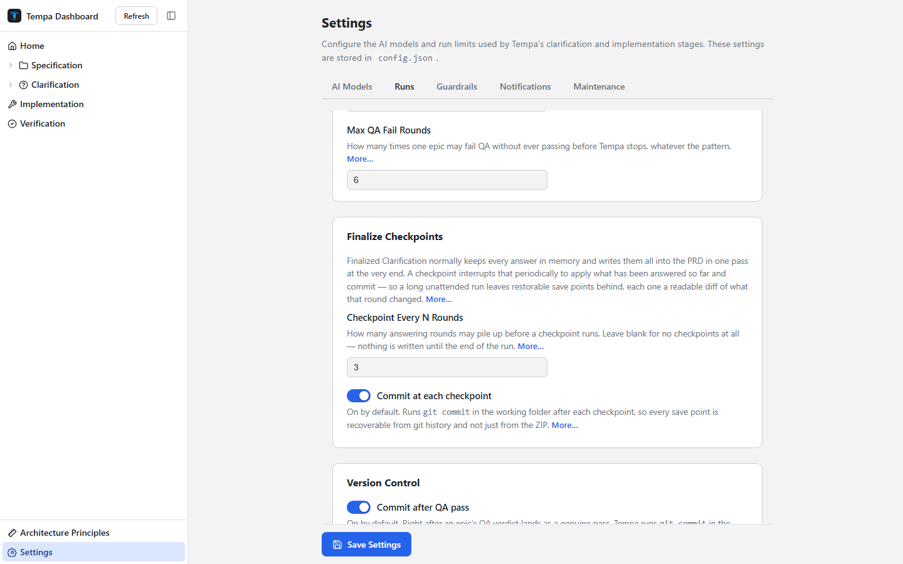

#### When there's nothing left to clarify

The opposite outcome is the happy one. Once every finding is answered and a round comes
back with **no critical or major findings** (with majors actually swept, and minors either
resolved or turned off via *Only evaluate critical & major findings*), Tempa treats
clarification as **settled**: **Start Clarification** and **Finalized Clarification** both
go grey, on the Clarification page and on Home step 2 alike, and the **Unanswered** table
says so instead of the usual "No unanswered files.":

> Nothing left to clarify — the latest clarification round found no open findings in your
> specification.

Nothing is broken — another round could only confirm what the last one already found, and
it would cost a full agent session to do it. **Start Implementation** is the next step.

Note this is decided from the *actual* finding counts, not from the Start Implementation
guardrail below: relax that to "No critical findings" or "No condition" and the two
clarification buttons stay live while findings are still open, because the questions
haven't been answered — you've only chosen to carry them into implementation.

To re-open clarification, change the specification. Adding, editing, renaming or deleting
a PRD file from the dashboard re-enables both buttons and re-closes the Start
Implementation gate, because the round that came back clean was looking at the older text.
The toast after the save says so.

### 5.7 When clarification never quite settles

A true story from the session used to build this guide: after switching to **Finalized
Clarification**, the critical count did reach zero and the phase widened to a **major
sweep** — but once major also hit zero and the run entered the *compaction* step (writing
into the PRD), **the verification evaluation that runs right after applying found new
critical/major findings of its own**. This is exactly what 5.5 describes: a freshly
updated PRD has new surface area that's never been checked yet. Finalize automatically
re-enters its loop (capped at 2 compactions per run), and on our run the count bounced
around 0–2 criticals for several more rounds without ever settling at zero for good.

**This is a real decision you may also face:** keep waiting for it to fully converge
(which can take anywhere from tens of minutes to several more hours), or move on to
implementation with whatever findings remain, if you judge that they don't affect
anything important you're about to build. For this demo we chose the second option.

#### Relaxing the Start Implementation requirement

By default, Settings → Guardrails → **Start Implementation requires** is set to **"No
critical or major findings"** — the safest option, but it means Start Implementation stays
locked as long as any finding remains open. To move on despite 1 remaining critical
finding, we changed it to **"No condition"**:

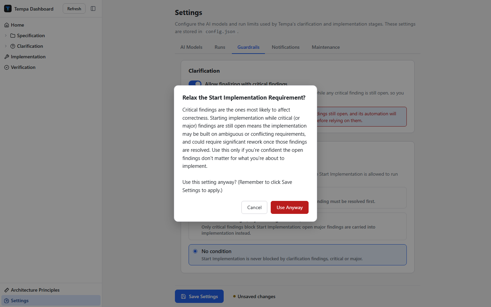

> **Same warning as the option in 5.6**: relaxing this requirement means implementation
> can start on top of a specification that may still be ambiguous in a few small spots.
> Only do this once you've reviewed the remaining findings and are confident they aren't
> critical to the features you're about to build. For a real project, the safest option is
> still to keep answering manually until it's genuinely 0/0/0 before moving on to
> implementation.

Worth knowing: "No condition" is also the way past the *specification changed* block. If
you edit a PRD file after clarification came back clean, Start Implementation locks again
until you run another round — "No critical findings" does **not** waive that (a changed
spec means the criticals are unmeasured, not zero), but "No condition" does.

Worth knowing: **relaxing this requirement does NOT remove the obligation to Apply
Answers.** Even at "No condition", Tempa still requires every saved answer to be written
into the PRD first (the "Pending resolutions" line must read zero) — so the decisions
you've already made are actually visible to the implementation process.

### 5.8 Apply Answers

Click **Apply Answers** to write every still-"floating" answer into the PRD document
(including auto-filling a recommendation for any finding that was never answered at all):

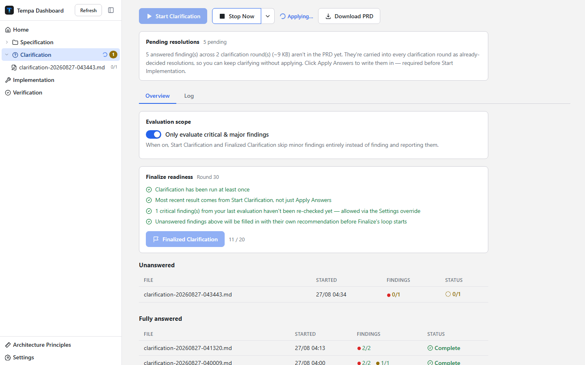

Once it finishes, the **Clarification** card on Home shows the final summary — in our
case: "0 of 58 finding(s) not yet answered (1 critical). Finalizing is allowed anyway via
the Settings override." — and the **Start Implementation** button in Step 3 is now active:

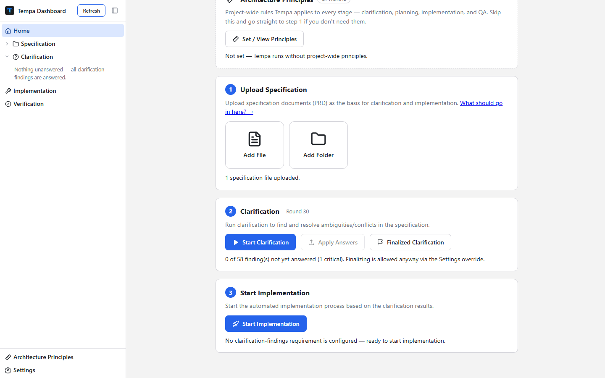

---

## 6. Start Implementation

Click **Start Implementation**. The page switches to the **Implementation** section, the
button turns into **Stop Now** with a **Running…** status, and the **Implementation
readiness** panel shows which requirement is in effect (in our example: critical/major
findings are allowed because the requirement was relaxed to "No condition" in 5.7):

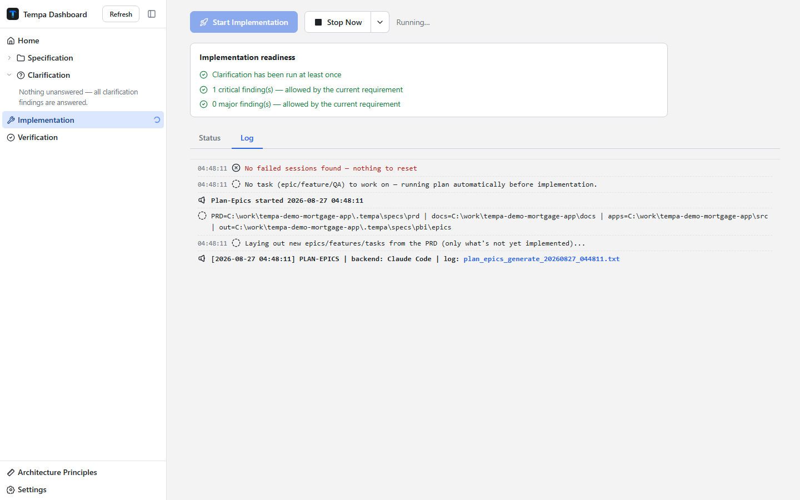

### 6.1 First stage: Plan Drafting (automatic)

Since there's no epic/feature at all yet, Tempa **automatically drafts a plan first**
before writing any code — studying the PRD (and the project's `docs/` folder, to know
what already exists), then laying out an **epic → feature → task** structure. The
**Status** tab shows this in progress (there's no epic to display yet):

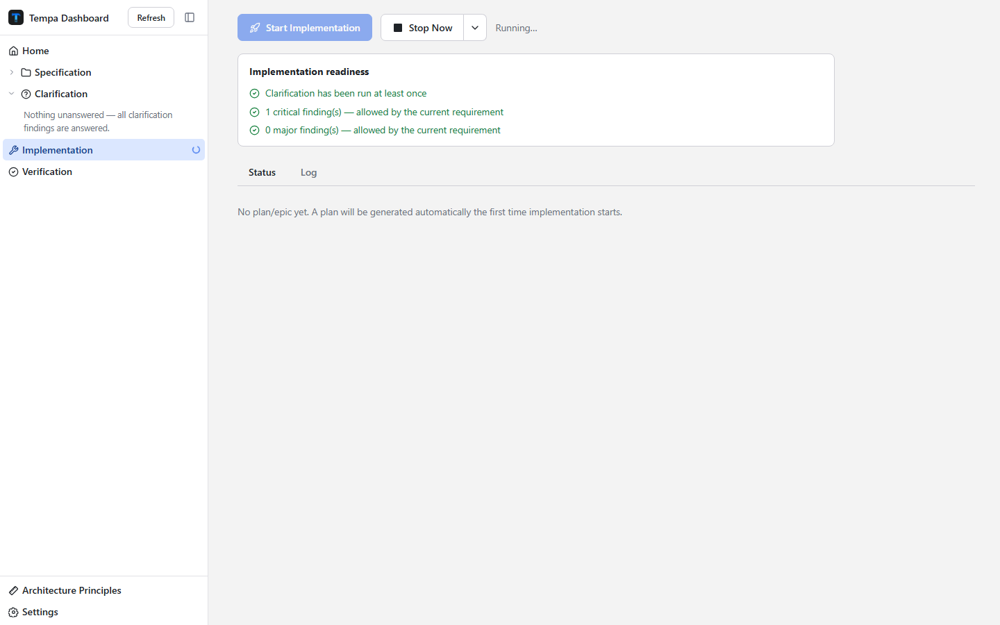

The **Log** tab is the most informative place to watch this — every stage (plan drafting,
per-epic implementation, QA, fixing) flows through the same log, separated by `== ... ==`
headers at the start of each new session.

### 6.2 The Status tab: watching epics & features

Once the plan is drafted, the **Status** tab lists every **epic** (and the features inside
it) with its own status. In our example, the mortgage-simulator PRD was broken down into
4 epics (EPIC-01 through EPIC-04) totaling 19 features:

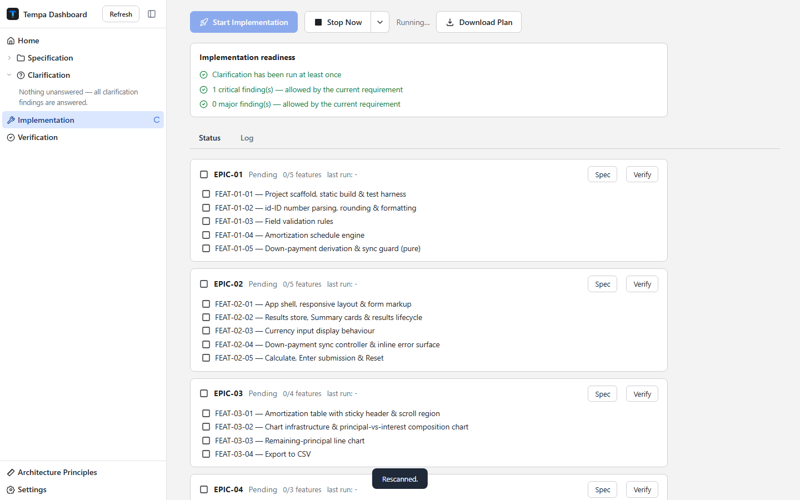

> Before the first epic actually starts, there's one extra step you might miss unless you
> open the Log tab: **REVIEW-EPICS** — a separate session that reviews the freshly drafted
> plan (coverage against the PRD, per-feature size, testability, potential for
> parallelism) and fixes it if needed, before implementation of the first feature begins.

Once EPIC-01 starts, its status turns into **On_progress** and the checkboxes next to its
features tick off one by one as each feature finishes:

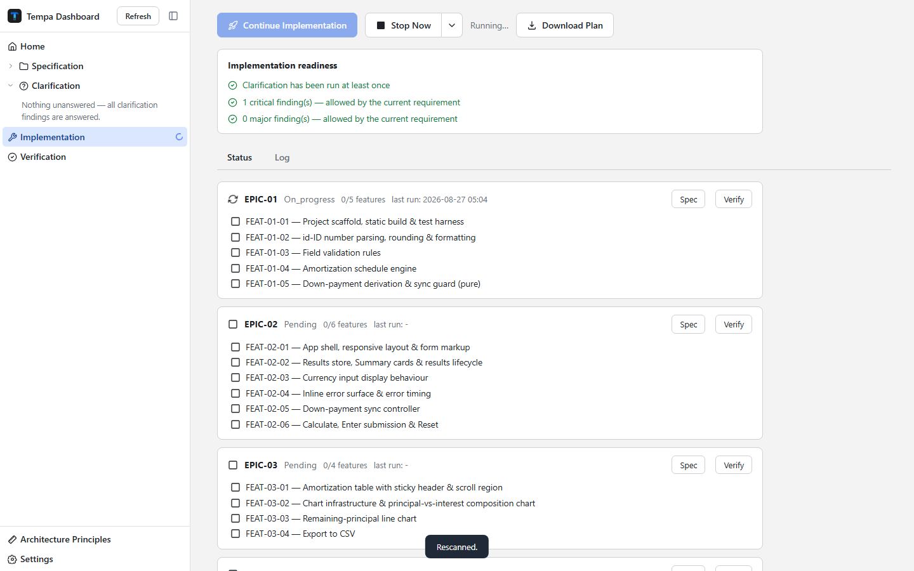

Once **all** features in that epic are done, its status turns into **Done** and QA runs
automatically right away (a **QA running** badge appears next to the epic's name) — with
nothing for you to trigger:

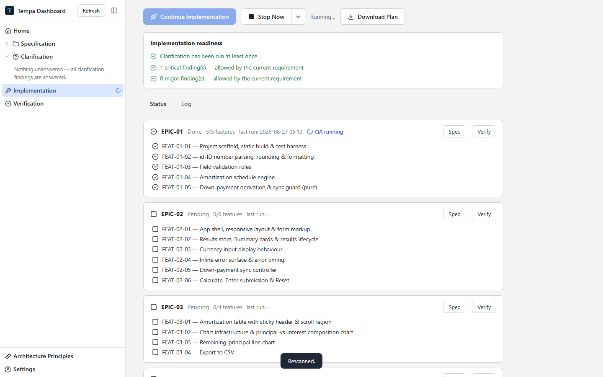

Every **epic** goes through this status cycle:

```
pending ──► on_progress ──► done ──►[QA]──► qa_passed=true ✅ (move on to the next epic)
                                      │
                                      └─(QA finds a problem)─► require_fixing ──► on_progress ──► ...
```

- **pending** — not started yet.
- **on_progress** — currently being implemented.
- **done** — every feature in this epic has been written, waiting for its turn at QA.
- **require_fixing** — was implemented once, but QA found a problem; it'll be fixed and
  re-QA'd.
- **failed** — a genuine session error (not just the AI usage limit running out — that's
  handled automatically by waiting it out). Needs your manual attention — see 6.7.
- **deferred** — this epic is waiting on **your decision** for one or more of its
  features (see 6.6), but the other epics keep running.

Click any epic to see its details, including **QA history** (every QA round ever run
against that epic, what it found, and a link to the full report).

### 6.3 The Log tab: following the process live

The **Log** tab shows raw console output — just like on Clarification, any
`log: filename.txt` line here can also be clicked to open that session's full log file
(implementation, QA, or plan) in a pop-up window:

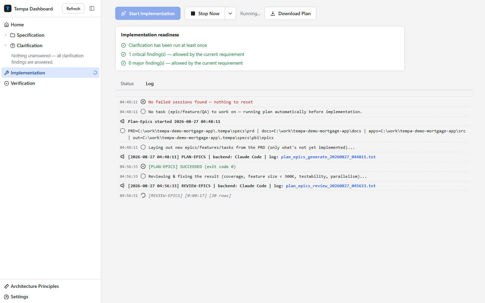

Click one of the blue log filenames (e.g. `qa_EPIC-04_...txt`) to open its full contents
in a pop-up — useful when you want to see exactly what the agent did/checked in one
particular session, without going to open the `.tempa/logs/` folder by hand:

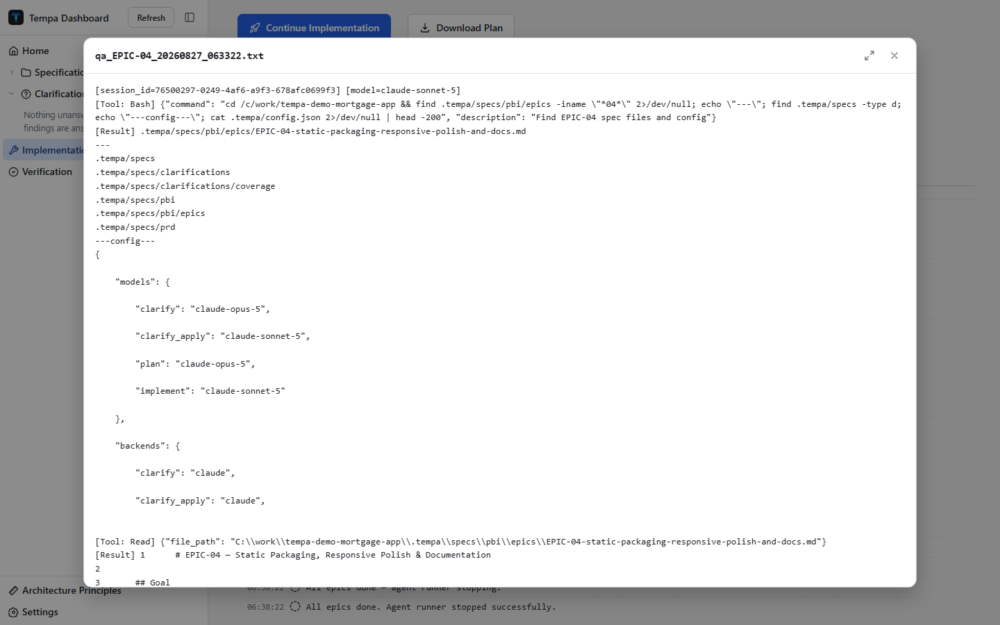

The expand button (to the left of **✕**) opens this pop-up in fullscreen mode — useful for
a long log. The log file's content is the session's raw transcript: every tool the agent
called (`Bash`, `Read`, `Edit`, etc.) along with its result, exactly as you'd see if you
opened the `.txt` file directly — including session info like the `session_id` and the
model used, at the very top.

### 6.4 The QA and automatic-fix loop

Once **every feature** in one epic is marked done, Tempa **automatically runs QA** against
that epic — a separate session that checks each feature against its spec, then assigns
one of three labels per feature:

- ❌ **Not implemented** / fails when actually run — **blocks** the epic (sets it to
  `require_fixing`).
- ⚠️ **Behaves differently from the spec** — also **blocks**.
- 📝 **Advisory note** — the behavior is correct and verified, just a minor suggestion
  (e.g. a test's name doesn't literally match a "How to test" sentence in the spec) —
  **doesn't** block the epic.

If QA finds a ❌/⚠️, the epic goes back to `require_fixing` and Tempa automatically runs a
**fix session** (nothing for you to do), then runs QA again against the same epic —
repeating until it passes clean. Each following QA round is told the previous round's
result, so it re-checks the old findings first before looking for new ones.

In our example, EPIC-01 (5 features: project scaffold, number parsing, field validation,
the amortization engine, and down-payment synchronization) passed QA on the **very first
round** — once QA finished, the badge next to the epic's name turned into **QA ok**:

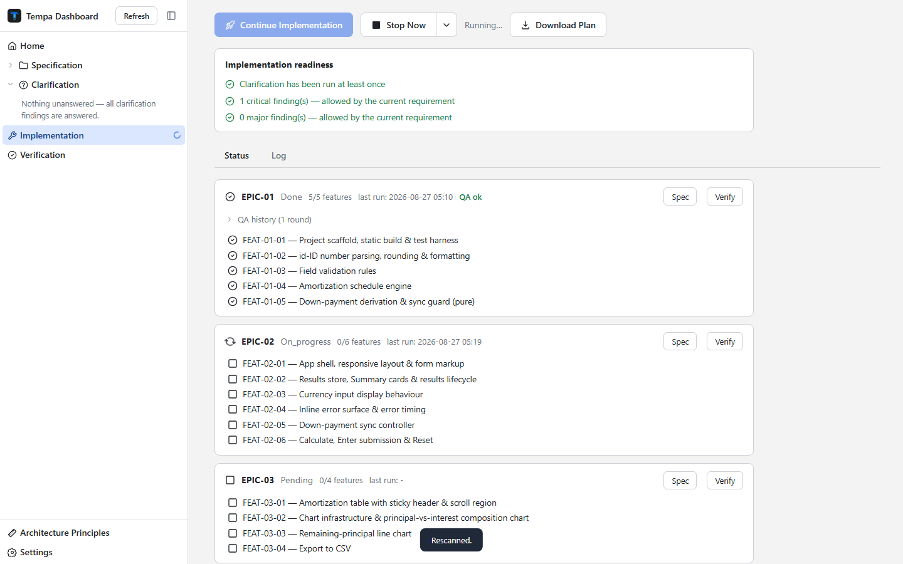

Click **QA history** to see the details of every QA round ever run for that epic, along
with its date:

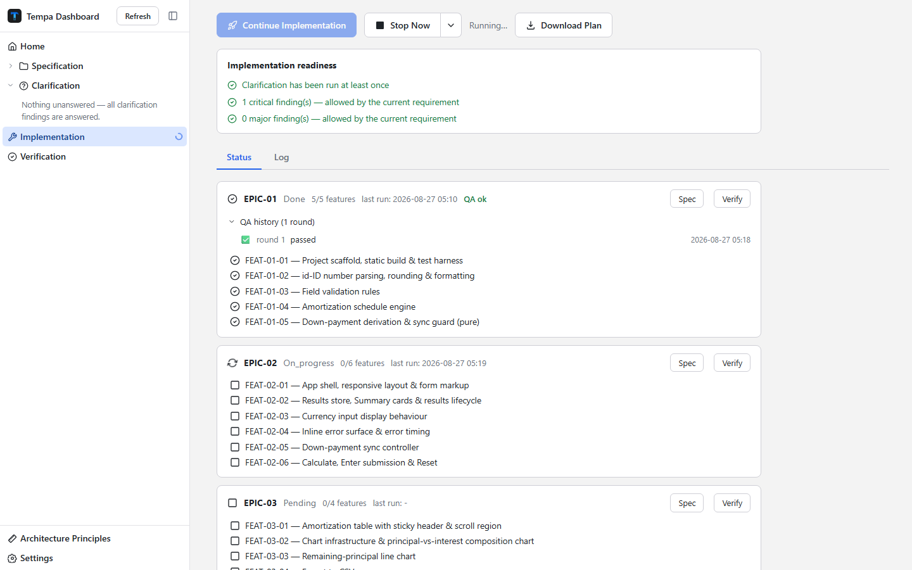

Once one epic passes, Tempa **moves straight on to the next epic** with no pause — this is
the epic → QA → (fix if needed) → next epic loop repeating until the whole plan is
finished, as described in 6.1.

EPIC-02 (the next one up) is a real example of the **fail-then-fix** cycle: its first QA
round flagged ❌ on FEAT-02-05, and once you open **QA history**, every round is shown with
a ✅/❌ mark plus a **report** link to the full QA report. Round two, after an automatic fix
session, finally passed:

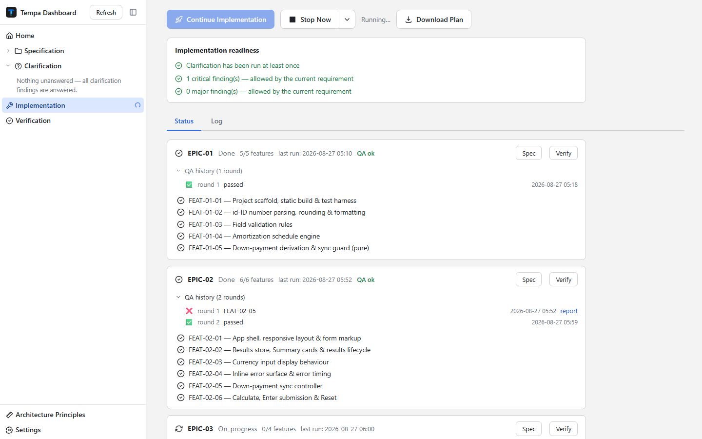

You don't have to do anything between those two rounds — the moment round 1 flagged ❌,
Tempa immediately ran a fix session for FEAT-02-05, then ran QA again, all in the same
automatic sequence.

**Automatic commit after QA passes** (Settings → Runs → "Version Control" → *Commit after
QA pass*, on by default) — right after an epic genuinely passes QA, Tempa runs
`git commit` in the working folder, so a long unattended run keeps a per-epic recovery
point instead of one giant diff at the end. This is skipped (logged, not an error) if the
working folder isn't a real git repository — like our demo workspace, which was
deliberately created as a plain empty folder rather than a git repo, to keep this guide's
focus on Tempa's own flow.

### 6.5 Reordering the backlog (cross-epic dependencies)

> On our simple example PRD, the four epics didn't have any complex dependency on each
> other, so this scenario didn't happen during the demo — this section is purely an
> explanation of documented behavior, for a bigger/more complex PRD with many
> interdependent epics.

Because epics are worked on **in plan order**, the plan sometimes places an epic before
another epic that's actually its *prerequisite* (e.g. a "Reports" epic needs functionality
from a "Transactions" epic that's actually scheduled later). When that happens, the
implementation session refuses to "work around" the architecture, and the epic appears to
sit still (the session finishes without adding any feature, repeatedly).

Tempa detects this automatically: once an epic has finished 2 sessions in a row with no
progress (`implement_no_progress_rounds`, adjustable under Settings → Runs), it asks the
agent to name **which epic** is actually blocking it, then — if it's safe to do —
**reorders** that epic to run first, and the epic that was stuck automatically returns to
the queue right after it. An `implementation_auto_reordered` notification (if email alerts
are enabled) is logged for this change.

This is purely a change in **work order**, not a change to the plan's content — both
epics still get fully implemented, just with the prerequisite one done first. If Tempa
can't resolve it on its own (most commonly: two epics depending on each other, a
*circular dependency*), the epic is marked `failed` with the agent's own explanation shown
right on the Status card — and that's the one case that genuinely needs a design decision
from you (merge the two epics, or move part of the feature elsewhere).

### 6.6 Possible clarification-style questions during implementation

> This scenario also didn't happen on our example PRD (every feature was clear enough to
> implement directly) — explained here purely from the official documentation, so you
> know what to expect if it happens on your own project.

Unlike a session stuck on a dependency (6.5, which Tempa can fix on its own), sometimes a
**feature** genuinely needs a **human decision** — a spec mentioning a feature that turns
out to no longer be relevant, a QA report recommending "implement this OR explicitly
descope it," a migration whose impact needs your explicit sign-off. This isn't a bug, and
it won't get better with another session.

For this case, the implementation session marks that **feature** (not the whole epic) as
`blocked` and writes down a **question** along with its **recommendation**. The epic keeps
working on its other, unaffected features; once only `blocked` features remain, the epic
turns `deferred` — a status that **doesn't stop** the runner, since the other epics keep
running.

A `deferred` epic's card shows the question and recommendation along with an **Answer…**
button, which opens a dialog with three choices: **follow the recommendation**, **write
your own answer**, or **drop this feature** — exactly the same pattern as answering
clarification findings in 5.3, just for a question that comes up **after** code has
already started being written. Once saved, the feature goes back to `require_fixing` and
its epic returns to the queue on the next round — the implementation session that picks it
up is told to apply your decision directly, not question it again.

### 6.7 Stopping the process (two ways)

Just like on Clarification, the **Stop Now** button is a split button:

- **Stop Now** — kills the process and the CLI backend it's running, immediately.
  Whatever the in-flight session had worked out but hadn't written yet is lost.
- **Stop After Current Session** (the small arrow next to Stop Now) — lets the session
  currently running finish and save its work first, then stops. No tokens are wasted, and
  you can resume anytime with **Continue Implementation**.

**A network hiccup or an AI usage limit doesn't just kill the process** — if the backend's
usage limit is hit, or its API reports itself as overloaded, Tempa waits (30 minutes for a
usage limit, 5 minutes for an overload) and then retries automatically, picking up exactly
where it left off. We ran into a variant of this firsthand while writing this guide: the
`claude` process happened to auto-update itself mid-session and failed for a moment —
once the update finished, simply clicking the same run button again continued from the
last saved status without losing anything.

Once any epic has actually run, the button's label changes to **Continue
Implementation** — clicking it automatically resets any epic that ended up `failed` back
to `pending` (exactly what `tempa implement --reset-failed` does) before continuing, so
one old failure doesn't lock the button forever.

---

## 7. After Implementation Finishes

The loop above (implement one or more features → QA → fix if needed → move on to the next
epic) keeps repeating on its own for **every** epic in the plan, with nothing left for you
to click in between — this is the "start it once, walk away" promise Tempa makes. On our
example, all four epics (19 features total) finished and passed QA in about 1 hour 50
minutes with zero manual intervention after the Start Implementation button was clicked —
EPIC-02 needed one fix round (6.4), the other three epics passed QA on the first try. Once
the last epic passes, the Status tab shows everything as **Done** with a **QA ok** badge,
the button reverts to **Continue Implementation** (no more **Stop Now**, since nothing is
running), and **Download Plan** is still available:

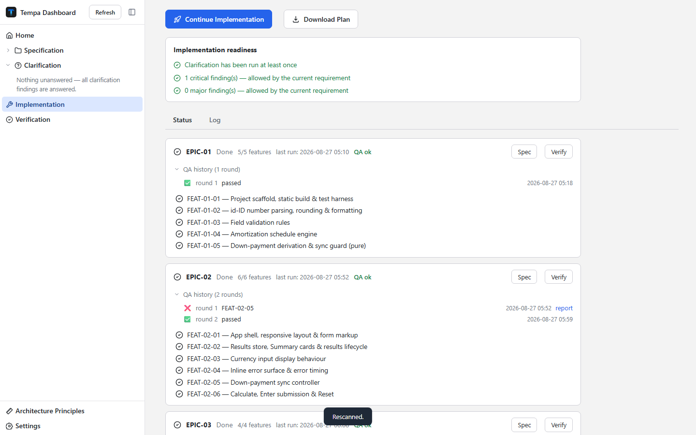

The **Log** tab records its closing lines clearly:

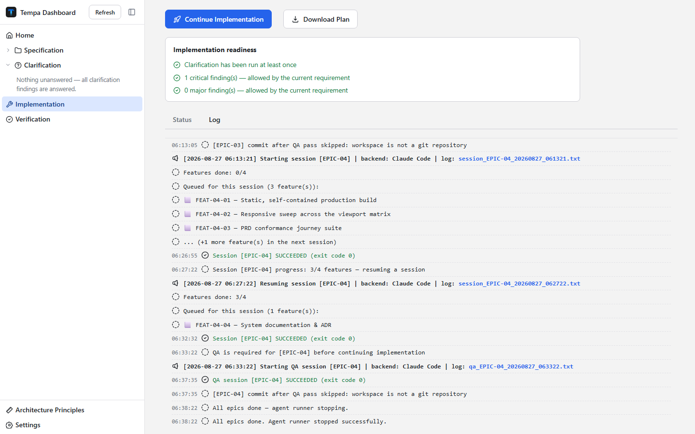

The runner stops automatically once:

- **Every epic is `done` and has passed QA** — as in our example: implementation is
  considered complete, the app's code is in your workspace's `src/` folder, ready to run
  or build per the tech stack specified in the PRD.
- **An epic has genuinely `failed`** (not just an AI usage limit/overload, which is
  handled automatically) — needs your attention, see 6.7.
- **An epic is `deferred`**, waiting on your answer (see 6.6), and there's no other work
  left.

### 7.1 Checking the final result

- **Download Plan** (the button above the Status/Log tabs) downloads the entire
  epic/feature plan as an offline reference.
- The **Verification** page (sidebar) runs a manual check of one epic against the
  finished code **without changing anything** — handy when you want to re-check a
  specific epic outside the automatic QA cycle. A **Verify** button is also available
  directly on each epic's card on the Status tab.
- From a terminal, `tempa status` prints the same epic/feature/QA status summary as the
  Status tab, if you'd rather use the command line.
- If **Commit after QA pass** is on and the workspace is a real git repository, every
  epic that passes QA is automatically saved as its own commit — so `git log` in your
  workspace becomes a clean, per-epic progress record.

### 7.2 If you want to keep going

Specification grown or changed after the first implementation pass finished? Just
upload/edit the specification again (step 4), run clarification if needed, then click
**Continue Implementation** — Tempa will draft a new plan for whatever hasn't been
implemented yet, without redoing what's already done.

---

## 8. Further Reading

This guide deliberately stops at the practical dashboard flow. For deeper detail on the
topics touched on above, the following documentation lives in this repo's
[`docs/`](../) folder:

- **Folder & Path Structure** — what a working folder is, `workspace.*`, `sources.*`:
  [docs/folders-and-paths.md](../folders-and-paths.md)
- **Writing a Good Specification** — worked examples, common mistakes:
  [docs/writing-a-spec.md](../writing-a-spec.md)
- **Architecture Principles** — cross-stage rules injected into every prompt:
  [docs/architecture-principles.md](../architecture-principles.md)
- **Clarify Modes** (`clarify`, `--auto-answer`, `--apply`, `--finalize`), the coverage
  ledger, severity phases in full detail: [docs/clarify-modes.md](../clarify-modes.md)
- **Start Implementation Details** — the full status lifecycle, cross-epic dependencies,
  recovery: [docs/start-implementation.md](../start-implementation.md)
- **AI Backend & Model per Stage** (Claude Code / Copilot CLI / Codex CLI):
  [docs/ai-models.md](../ai-models.md)
- **CLI Backend Availability** — how the ✅/⬜ checklist on Home/Settings works:
  [docs/cli-availability.md](../cli-availability.md)
- **Full CLI Command Reference**: [docs/command-reference.md](../command-reference.md)
- **`config.json` structure** — every key and what it does:
  [docs/config-json.md](../config-json.md)
- **Logs & Output** — where every kind of log lives: [docs/logging.md](../logging.md)
- The root **README.md** — the overall CLI and dashboard flow summarized:
  [README.md](../../README.md)
