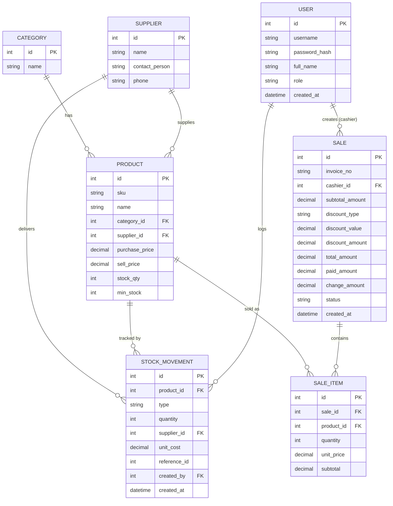

# PRD — Retail Store POS & Inventory System (Web + Database)

## 1. Purpose

A web-based system for a small-to-medium retail store to manage product & inventory master
data, run sales transactions at the register (point of sale), and view basic sales/stock
reports — replacing manual bookkeeping (spreadsheets/notebooks).

**For whom:** store owner (Admin) and cashiers (Cashier) of a single-outlet retail store.

**Important note:** this is a **web application with a backend and a relational database**.
Data (products, stock, transactions, users) is persisted and must survive across sessions
and browser restarts.

**Conventions:** a single currency throughout (no currency selector) — every money field is
`DECIMAL(12,2)` and every computed money value is rounded half-up to 2 decimals. Timestamps
are stored in UTC; the store's local timezone is one deploy-time setting, and every "day"
boundary in this document (dashboard "today", daily report grouping, same-day void) is
evaluated in that store timezone.

## 2. Business Process / Usage Flow

1. **Login** — Admin and Cashier log in with username/password. Access is role-based:
   - **Admin**: full access — master data, stock in, reports, sale void, user management.
   - **Cashier**: POS/checkout, the cashier dashboard (see section 4), and a read-only list
     of the sales they created themselves, filtered by date (defaults to today). No master
     data, no stock in, no reports, no user management, no void.
2. **Master Data Management (Admin)**:
   - Manage **Categories** (e.g. Beverages, Snacks, Household).
   - Manage **Suppliers** (name, contact person, phone).
   - Manage **Products**: name, SKU, category, supplier, purchase price, sell price, current
     stock quantity, minimum stock threshold.
3. **Stock In (Admin)** — record incoming stock from a supplier (product, supplier, quantity,
   purchase price at time of receipt); the system increases the product's stock quantity, logs
   a stock movement of type `in` carrying that supplier and unit cost, and overwrites the
   product's `purchase_price` with the receipt price (the historical cost stays on the
   movement).
4. **Sales Transaction / POS (Cashier)**:
   - Search/select products (by name or scan/enter SKU).
   - Add to cart with quantity; system shows subtotal per line and running total.
   - Apply an optional discount on the whole transaction, entered either as a percentage
     (0–100) or as a fixed amount.
   - Enter amount paid (cash); system computes change.
   - On checkout confirmation: system creates a **Sale** record with its **Sale Items**,
     decrements stock quantity for each product sold, and logs a stock movement (type:
     "out") per item.
   - System shows an on-screen receipt summary (physical printer integration is out of
     scope).

   **Money rules for a sale** — these define "total due" everywhere in this document:
   - `SaleItem.subtotal` = `quantity * unit_price` — the line total, before any discount.
   - `Sale.subtotal_amount` = the sum of every `SaleItem.subtotal` on the sale.
   - `Sale.discount_amount` = the discount resolved to a currency amount: for
     `discount_type = "percent"` it is `subtotal_amount * discount_value / 100`; for
     `discount_type = "amount"` it is `discount_value` as entered. It is capped at
     `subtotal_amount` (and a percentage is capped at 100), so a discount can never push the
     total below zero.
   - `Sale.total_amount` = `subtotal_amount - discount_amount` — **this is the total due**:
     the amount the cashier collects, and the figure the sales report sums as revenue.
   - `Sale.change_amount` = `paid_amount - total_amount`.
5. **Reports (Admin)**:
   - Daily/monthly sales report (total revenue, number of transactions) filterable by date
     range.
   - Best-selling products report.
   - Low-stock alert list (products where `stock_qty <= min_stock`).
6. **Sale Void/Cancellation (Admin only, same-day)** — an Admin can void a sale while its
   `status` is `completed` and its `created_at` falls on the current calendar day in the store
   timezone. Voiding restores the stock quantity for every item in the sale, logs one stock
   movement of type `adjustment` per item referencing that sale, and sets the sale's status to
   `voided`. A sale created on an earlier day, or one that is already voided, cannot be
   voided — correcting it is a manual stock adjustment instead.

Validation to handle:
- Cannot sell a quantity greater than current stock on hand.
- SKU must be unique across products.
- Cashier cannot access master-data, stock-in, reports, user-management or void
  screens/endpoints (enforced both in UI and at the API layer).
- A sale cannot be finalized with an empty cart, or with `paid_amount` less than
  `total_amount` (the total due, i.e. after discount).
- A sale can only be voided on the same calendar day it was created (store timezone), and a
  sale that is already `voided` cannot be voided again.

## 3. Data Model & ERD

### Entities

- **User** — `id`, `username`, `password_hash`, `full_name`, `role` (`admin` | `cashier`),
  `created_at`
- **Category** — `id`, `name`
- **Supplier** — `id`, `name`, `contact_person`, `phone`
- **Product** — `id`, `sku`, `name`, `category_id` (FK → Category), `supplier_id`
  (FK → Supplier), `purchase_price`, `sell_price`, `stock_qty`, `min_stock`
- **StockMovement** — `id`, `product_id` (FK → Product), `type` (`in` | `out` |
  `adjustment`), `quantity`, `supplier_id` (nullable FK → Supplier; set for `in`, null for
  `out` and `adjustment`), `unit_cost` (nullable; the receipt price, set for `in`),
  `reference_id` (nullable, e.g. related Sale id), `created_by` (FK → User), `created_at`
- **Sale** — `id`, `invoice_no`, `cashier_id` (FK → User), `subtotal_amount`, `discount_type`
  (`none` | `percent` | `amount`, default `none`), `discount_value` (default `0`),
  `discount_amount` (default `0`), `total_amount`, `paid_amount`, `change_amount`, `status`
  (`completed` | `voided`), `created_at`
- **SaleItem** — `id`, `sale_id` (FK → Sale), `product_id` (FK → Product), `quantity`,
  `unit_price`, `subtotal`

### Relationships

- One **Category** has many **Products** (1—N)
- One **Supplier** has many **Products** (1—N)
- One **Supplier** has many **StockMovements** (1—N, stock-in receipts only)
- One **Product** has many **StockMovements** (1—N)
- One **Product** has many **SaleItems** (1—N)
- One **User** creates many **Sales** as cashier (1—N)
- One **User** creates many **StockMovements** (1—N)
- One **Sale** has many **SaleItems** (1—N)

### ERD (Mermaid)

## 4. UI Concept

- **Login page** — username/password form.
- **Dashboard** (landing page after login) — content depends on role. **Admin**: today's
  store-wide sales summary (revenue, transaction count) plus the low-stock alert widget.
  **Cashier**: only their own figures for today (how many sales they completed and how much
  they collected) — no store-wide revenue, no low-stock widget.
- **Master Data pages** (Admin only) — tabbed or separate pages for Categories, Suppliers,
  Products; table view with search/filter + modal form for create/edit.
- **Stock In page** (Admin only) — form to record incoming stock: pick product, supplier
  (defaults to the product's supplier, changeable), quantity, purchase price.
- **POS / Checkout page** (Cashier) — product search/grid on one side, running cart with
  quantity controls on the other, discount + payment input, "Complete Sale" action, receipt
  summary shown after checkout.
- **My Transactions page** (Cashier) — read-only list of the sales the logged-in cashier
  created, with a date filter (defaults to today) and the receipt summary for each sale.
- **Reports page** (Admin only) — date-range filter, sales summary table/chart, best-sellers
  table, low-stock table.
- Role-based navigation: Cashier sees Dashboard, POS and My Transactions; Admin sees
  everything.

## 5. Tech Stack

- **Frontend:** React + Vite (TypeScript), following Tempa's multi-service layout under
  `src/web`.
- **Backend:** Node.js + Express REST API (TypeScript), under `src/backend`.
- **Database:** PostgreSQL accessed via the Prisma ORM — this app **does access a database**,
  unlike the other example scenario.
- **Auth:** username/password login issuing JWT bearer tokens (no server-side sessions), with
  role-based access control (Admin vs Cashier) enforced on both frontend routes and backend
  endpoints.
- **Testing:** API-level tests (e.g. via CURL/HTTP client) for every endpoint, plus
  Playwright-style end-to-end tests for the POS checkout flow.

## 6. Non-Goals (Explicitly Out of Scope)

- No multi-branch/multi-outlet support (single store only).
- No payment gateway integration (cash payment only for this scope).
- No e-commerce/online storefront integration.
- No multi-currency support.
- No physical receipt printer integration (on-screen receipt only).

## 7. Acceptance Criteria (Examples)

1. Creating a Product with a duplicate SKU is rejected with a clear validation error.
2. Recording a Stock In of 50 units for a product at purchase price 8.00 from Supplier X
   increases its `stock_qty` by 50, creates one `StockMovement` record with `type = "in"`,
   `supplier_id` = Supplier X and `unit_cost = 8.00`, and sets the product's `purchase_price`
   to 8.00.
3. Completing a sale of 3 units of a product that only has 2 units in stock is rejected
   before the sale is created (no partial stock deduction).
4. Completing a valid sale of 2 units at unit price 25.00 with no discount, paid amount
   60.00 → `subtotal_amount = 50.00`, `discount_amount = 0.00`, `total_amount = 50.00`,
   `change_amount = 10.00`, product `stock_qty` decreases by 2, and one `StockMovement` with
   `type = "out"` is created per sale item.
5. Completing that same 2-unit sale with a 10% discount, paid amount 50.00 →
   `subtotal_amount = 50.00`, `discount_type = "percent"`, `discount_value = 10`,
   `discount_amount = 5.00`, `total_amount = 45.00`, `change_amount = 5.00`. Paying only
   40.00 for that cart is rejected as less than the total due.
6. A Cashier-role user attempting to access the Products management endpoint/page receives
   a 403/forbidden response, both via direct API call and via the UI route.
7. Voiding a sale created earlier on the same day restores the stock quantities for every
   item in that sale, marks the sale `status = "voided"`, and creates one `StockMovement`
   with `type = "adjustment"` per item; attempting to void a sale created on a previous day
   is rejected with a clear error and changes no stock.
