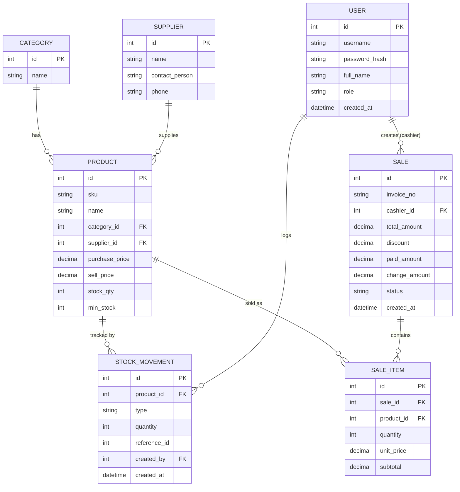

# PRD — Retail Store POS & Inventory System (Web + Database)

## 1. Purpose

A web-based system for a small-to-medium retail store to manage product & inventory master
data, run sales transactions at the register (point of sale), and view basic sales/stock
reports — replacing manual bookkeeping (spreadsheets/notebooks).

**For whom:** store owner (Admin) and cashiers (Cashier) of a single-outlet retail store.

**Important note:** this is a **web application with a backend and a relational database**.
Data (products, stock, transactions, users) is persisted and must survive across sessions
and browser restarts.

## 2. Business Process / Usage Flow

1. **Login** — Admin and Cashier log in with username/password. Access is role-based:
   - **Admin**: full access (master data, stock in, reports, user management).
   - **Cashier**: POS/checkout access only, plus viewing their own shift's transaction
     history.
2. **Master Data Management (Admin)**:
   - Manage **Categories** (e.g. Beverages, Snacks, Household).
   - Manage **Suppliers** (name, contact person, phone).
   - Manage **Products**: name, SKU, category, supplier, purchase price, sell price, current
     stock quantity, minimum stock threshold.
3. **Stock In (Admin)** — record incoming stock from a supplier (product, quantity,
   purchase price at time of receipt); the system increases the product's stock quantity and
   logs a stock movement record.
4. **Sales Transaction / POS (Cashier)**:
   - Search/select products (by name or scan/enter SKU).
   - Add to cart with quantity; system shows subtotal per line and running total.
   - Apply an optional discount (percentage or fixed amount) on the whole transaction.
   - Enter amount paid (cash); system computes change.
   - On checkout confirmation: system creates a **Sale** record with its **Sale Items**,
     decrements stock quantity for each product sold, and logs a stock movement (type:
     "out") per item.
   - System prints/shows a receipt summary (on-screen; physical printer integration is out
     of scope).
5. **Reports (Admin)**:
   - Daily/monthly sales report (total revenue, number of transactions) filterable by date
     range.
   - Best-selling products report.
   - Low-stock alert list (products where `stock_qty <= min_stock`).
6. **Sale Void/Cancellation (Admin only, same-day)** — Admin can void a completed sale;
   system restores stock quantity and logs a corresponding stock movement (type:
   "adjustment").

Validation to handle:
- Cannot sell a quantity greater than current stock on hand.
- SKU must be unique across products.
- Cashier cannot access master-data or user-management screens (enforced both in UI and at
  the API layer).
- A sale cannot be finalized with an empty cart or with paid amount less than the total due.

## 3. Data Model & ERD

### Entities

- **User** — `id`, `username`, `password_hash`, `full_name`, `role` (`admin` | `cashier`),
  `created_at`
- **Category** — `id`, `name`
- **Supplier** — `id`, `name`, `contact_person`, `phone`
- **Product** — `id`, `sku`, `name`, `category_id` (FK → Category), `supplier_id`
  (FK → Supplier), `purchase_price`, `sell_price`, `stock_qty`, `min_stock`
- **StockMovement** — `id`, `product_id` (FK → Product), `type` (`in` | `out` |
  `adjustment`), `quantity`, `reference_id` (nullable, e.g. related Sale id), `created_by`
  (FK → User), `created_at`
- **Sale** — `id`, `invoice_no`, `cashier_id` (FK → User), `total_amount`, `discount`,
  `paid_amount`, `change_amount`, `status` (`completed` | `voided`), `created_at`
- **SaleItem** — `id`, `sale_id` (FK → Sale), `product_id` (FK → Product), `quantity`,
  `unit_price`, `subtotal`

### Relationships

- One **Category** has many **Products** (1—N)
- One **Supplier** has many **Products** (1—N)
- One **Product** has many **StockMovements** (1—N)
- One **Product** has many **SaleItems** (1—N)
- One **User** creates many **Sales** as cashier (1—N)
- One **User** creates many **StockMovements** (1—N)
- One **Sale** has many **SaleItems** (1—N)

### ERD (Mermaid)

## 4. UI Concept

- **Login page** — username/password form.
- **Dashboard** (landing page after login) — today's sales summary, low-stock alert widget.
- **Master Data pages** (Admin only) — tabbed or separate pages for Categories, Suppliers,
  Products; table view with search/filter + modal form for create/edit.
- **Stock In page** (Admin only) — form to record incoming stock: pick product, quantity,
  purchase price, supplier reference.
- **POS / Checkout page** (Cashier) — product search/grid on one side, running cart with
  quantity controls on the other, discount + payment input, "Complete Sale" action, receipt
  summary shown after checkout.
- **Reports page** (Admin only) — date-range filter, sales summary table/chart, best-sellers
  table, low-stock table.
- Role-based navigation: Cashier only sees Dashboard (limited) + POS + own transaction
  history; Admin sees everything.

## 5. Tech Stack

- **Frontend:** React (or an equivalent SPA framework), following Tempa's multi-service
  layout under `apps/web`.
- **Backend:** REST API service (e.g. Node.js/Express or an equivalent framework), under
  `apps/backend`.
- **Database:** relational database (e.g. PostgreSQL or MySQL) accessed via an ORM (e.g.
  Prisma) — this app **does access a database**, unlike the other two example scenarios.
- **Auth:** username/password login, session or JWT-based, with role-based access control
  (Admin vs Cashier) enforced on both frontend routes and backend endpoints.
- **Testing:** API-level tests (e.g. via CURL/HTTP client) for every endpoint, plus
  Playwright-style end-to-end tests for the POS checkout flow.

## 6. Non-Goals (Explicitly Out of Scope)

- No multi-branch/multi-outlet support (single store only).
- No payment gateway integration (cash payment only for this scope).
- No e-commerce/online storefront integration.
- No multi-currency support.
- No physical receipt printer integration (on-screen receipt only).

## 7. Acceptance Criteria (Examples)

1. Creating a Product with a duplicate SKU is rejected with a clear validation error.
2. Recording a Stock In of 50 units for a product increases its `stock_qty` by 50 and
   creates one `StockMovement` record with `type = "in"`.
3. Completing a sale of 3 units of a product that only has 2 units in stock is rejected
   before the sale is created (no partial stock deduction).
4. Completing a valid sale of 2 units at unit price 25.00 with no discount, paid amount
   60.00 → `total_amount = 50.00`, `change_amount = 10.00`, product `stock_qty` decreases
   by 2, and one `StockMovement` with `type = "out"` is created per sale item.
5. A Cashier-role user attempting to access the Products management endpoint/page receives
   a 403/forbidden response, both via direct API call and via the UI route.
6. Voiding a completed sale restores the stock quantities for every item in that sale and
   marks the sale `status = "voided"`.
